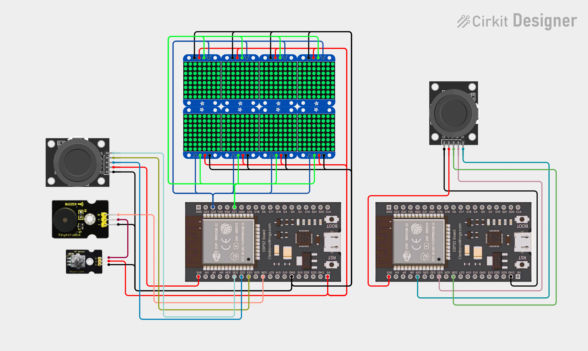

# EspSnake vezérlése 🐍

Ebben a projektben két ESP32 mikrokontroller együttműködésével valósul meg egy kétszemélyes Snake játék. A kijelzőfelületet 8 db 8x8 LED mátrix alkotja, amelyek 2 sorba, 4-4-es elrendezésben vannak sorba kötve. Az egyik ESP32 fogadja a saját játékos joystick bemenetét, míg a másik ESP32-től ESP-NOW protokollon keresztül megkapja a másik játékos irányítását. A két irányítási adatot összevetve egyetlen játékképernyőt rajzol ki a mátrixokra, így lehetővé válik a Snake PvP üzemmód. A projekt során a résztvevők megismerik az ESP-NOW kommunikáció alapjait, mátrixkezelést, játékszabály-implementációt, és többkijelzős grafikus megjelenítést.

**🛠️ Fontos:** 📝 mindent a rajz alapján csináljatok, mert így biztosított a tökéletes működés. A progranban az elnevezések relatívak, nem muszáj azt használni. Ha mást használtok, akkor figyeljetek arra, hogy könnyen lehessen azonosítani az egyes vátozó neveket. 🔍

🤓 Aki foglalkozott már hasonlóval és szertne egy kicsit bonyolultabb feladaton gondolkodni annak van egy **exta feladat** a füzet végén. 📖💡

🔗 Minden feladatrész ugyanahoz a feladathoz tartozik. A feladatok között nem kell semmit átállítani, vagy megváltoztani. Ha egy feladatban egy elemet nem használsz és be van kötve attól nem lesz rossz, nem kell kivenni az alapból. 🔄✅

---
**Tartalomjegyzék:**
-   [Eszközök](#️-eszközök-amikre-szükséged-lesz)
-   [0. Feladat](#0-feladat)
-   [1. Feladat](#1-feladat)
-   [2. Feladat](#2-feladat) 
-   [3. Feladat](#3-feladat)
-   [4. Feladat](#4-feladat)
-   [Teljes rendszer](#a-teljes-rendszer-működtetése)
-   [Extra Feladat](#extra-feladat)

---

# 🛠️ Eszközök, amikre szükséged lesz:
- 🧠 2 db ESP32 mikrokontroller
- 🟦 8 db 8×8 LED mátrix
- 🎮 2 db joystick modul
- 📡 ESP-NOW protokoll
- 🎯 Kettős vezérlés, közös játéktér frissítéssel

---

# 0. Feladat:
⚙️ Kapcsolási rajz: (Először ez alapján csináljátok meg a kezdő állapotot.) 

---

# 1. Feladat:

---

# 2. Feladat:

---

# 3. Feladat:

---

# 4. Feladat:

---

# Teljes rendszer
**A teljes esp vezérlése** 

🛠️ Eszközök:
- 🧠 2 db ESP32 mikrokontroller
- 🟦 8 db 8×8 LED mátrix ( MAX7219-es vagy sorba köthető típus )
- 🎮 2 db joystick modul
- 📡 ESP-NOW protokoll ( ESP32 közötti vezeték nélküli kommunikációhoz )
- 🎯 Kettős vezérlés, közös játéktér frissítéssel

### **🏆 Extra feladat:**  
**🛠️ Extra feladat:** Ha elkészült az alap projekt, és van kedved feltúrbózni, itt egy gondolkodós kihívás! 🤔

✅ Sok sikert! 😊