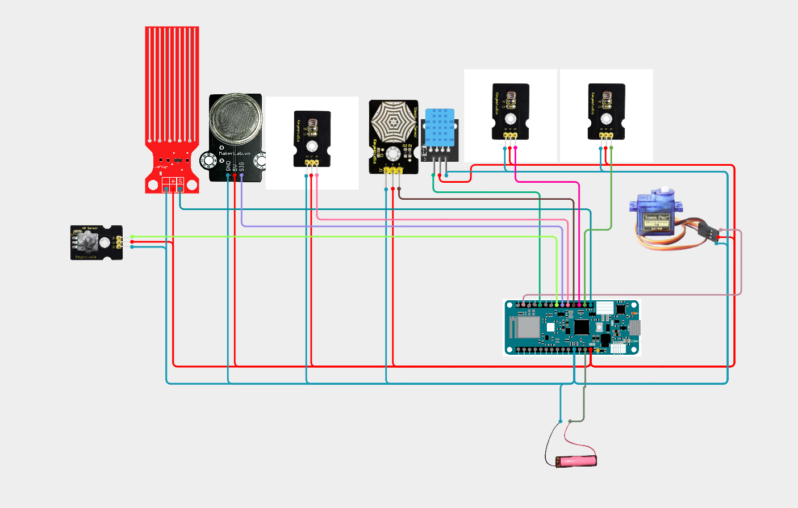

# Időjárásállomás 🌡️🌁

Mini időjárásállomás 
Valósíts meg egy környezeti szenzorokon alapuló időjárásállomást Arduino Nano 33 Sense segítségével, amely hőmérsékletet, páratartalmat, napfényerősséget és hangszennyezettséget mér. Az adatok grafikonos formában jelennek meg egy weboldalon, amelyet a Nano beépített WiFi kapcsolattal szolgál ki. A rendszer napelemes táplálásra van tervezve, és a napelem aktuális feszültségszintjét is megjeleníti, hogy követhető legyen a töltés. Opcionálisan egy szervómotor a fény irányába fordítja a napelemet, a beépített fényérzékelő adatainak felhasználásával.

**🛠️ Fontos:** 📝 mindent a rajz alapján csináljatok, mert így biztosított a tökéletes működés. A progranban az elnevezések relatívak, nem muszáj azt használni. Ha mást használtok, akkor figyeljetek arra, hogy könnyen lehessen azonosítani az egyes vátozó neveket. 🔍

🤓 Aki foglalkozott már hasonlóval és szertne egy kicsit bonyolultabb feladaton gondolkodni annak van egy **exta feladat** a füzet végén. 📖💡

🔗 Minden feladatrész ugyanahoz a feladathoz tartozik. A feladatok között nem kell semmit átállítani, vagy megváltoztani. Ha egy feladatban egy elemet nem használsz és be van kötve attól nem lesz rossz, nem kell kivenni az alapból. 🔄✅

---
**Tartalomjegyzék:**
-   [Eszközök](#️-eszközök-amikre-szükséged-lesz)
-   [0. Feladat](#0-feladat)
-   [1. Feladat](#1-feladat)
-   [2. Feladat](#2-feladat) 
-   [3. Feladat](#3-feladat)
-   [4. Feladat](#4-feladat)
-   [Teljes rendszer](#a-teljes-rendszer-működtetése)
-   [Extra Feladat](#extra-feladat)

---

# 🛠️ Eszközök, amikre szükséged lesz:
- 📶 Arduino MKR WiFi
- ☀️ Napelem + feszültségosztó
- 🌗 Beépített fényérzékelő 
- 🎤 Beépített mikrofon 
- 🌡️ DHT11 vagy beépített szenzor – hőmérséklet & páratartalom
- ⚙️ Szervómotor 
- 📊 Webes adatmegjelenítés grafikonokkal WiFi-n keresztül

---

# 0. Feladat:
⚙️ Kapcsolási rajz: (Először ez alapján csináljátok meg a kezdő állapotot.) 

---

# 1. Feladat:

---

# 2. Feladat:

---

# 3. Feladat:

---

# 4. Feladat:

---

# Teljes rendszer
**A teljes időjárásállomás vezérlése** 

🛠️ Eszközök: 
- 📶 Arduino MKR WiFi
- ☀️ Napelem + feszültségosztó ( 🔋 töltöttség méréshez )
- 🌗 Beépített fényérzékelő ( ALS )
- 🎤 Beépített mikrofon ( 📈 hangszint érzékeléshez )
- 🌡️ DHT11 vagy beépített szenzor – hőmérséklet & páratartalom
- ⚙️ Szervómotor ( 🌞 napkövető funkció – opcionális )
- 📊 Webes adatmegjelenítés grafikonokkal WiFi-n keresztül

### **🏆 Extra feladat:**  
**🛠️ Extra feladat:** Ha elkészült az alap projekt, és van kedved feltúrbózni, itt egy gondolkodós kihívás! 🤔

✅ Sok sikert! 😊