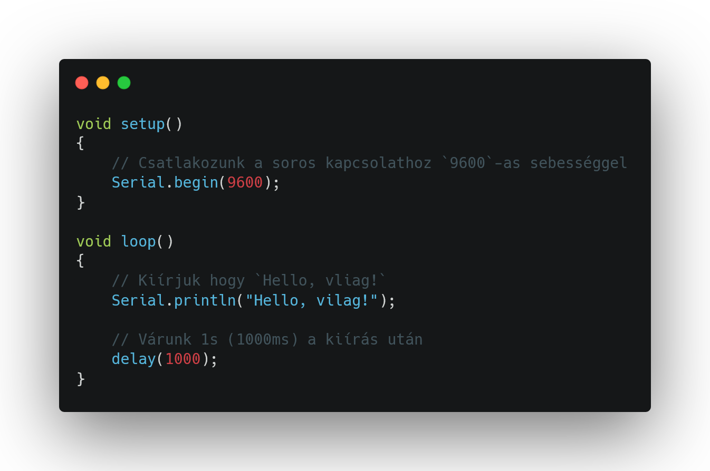
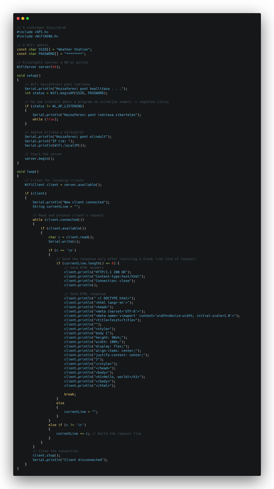

# Időjárásállomás 🌡️🌁

**🛠️ Fontos:** 📝 mindent a rajz alapján csináljatok, mert így biztosított a tökéletes működés. A progranban az elnevezések relatívak, nem muszáj azt használni. Ha mást használtok, akkor figyeljetek arra, hogy könnyen lehessen azonosítani az egyes vátozó neveket. 🔍

🤓 Aki foglalkozott már hasonlóval és szertne egy kicsit bonyolultabb feladaton gondolkodni annak van egy **exta feladat** a füzet végén. 📖💡

🔗 Minden feladatrész ugyanahoz a feladathoz tartozik. A feladatok között nem kell semmit átállítani, vagy megváltoztani. Ha egy feladatban egy elemet nem használsz és be van kötve attól nem lesz rossz, nem kell kivenni az alapból. 🔄✅

---
**Tartalomjegyzék:**
-   [Eszközök](#️-eszközök-amikre-szükséged-lesz)
-   [1. Feladat](#1-feladat)
-   [2. Feladat](#2-feladat) 
-   [3. Feladat](#3-feladat)
-   [4. Feladat](#4-feladat)
-   [5. Feladat](#5-feladat)
-   [6. Feladat](#6-feladat)
-   [Teljes rendszer](#teljes-rendszer)
-   [Extra Feladat](#-extra-feladat)

---

# 🛠️ Eszközök, amikre szükséged lesz:
- 📶 Arduino MKR WiFi
- ☀️ Napelem + feszültségosztó
- 🌗 Beépített fényérzékelő 
- 🎤 Beépített mikrofon 
- 🌡️ DHT11 vagy beépített szenzor – hőmérséklet & páratartalom
- ⚙️ Szervómotor 
- 📊 Webes adatmegjelenítés grafikonokkal WiFi-n keresztül

---

# 1. Feladat:
Mielőtt bármi mást csinálnánk, először működésre kell bírnunk az Arduinót ⚙️. Az MKR 1000 nem indul be olyan egyszerűen, mint egy sima UNO 🔌, de ne aggódj – ez sem sokkal bonyolultabb 😌.

Mindössze egy csomagot kell letöltened az Arduino IDE-n belül 💻:

1. A bal oldali menüben válaszd ki a Boards Manager opciót 🧰.
2. Keresd meg a következőt: 🔍 Arduino SAMD Boards (32-bits ARM Cortex-M0+)
3. Telepítsd azt, amelyiknél az van írva, hogy by Arduino ✅.

Ha ez megvan, akkor a megszokott módon töltsd fel az alábbi kódot 📥, majd figyeld a soros monitort 🖥️, hogy megjelenik-e a megfelelő szöveg 🧐.



Ezt kellene látnod a soros kapcsolat ablakában 🖥️, ha minden megfelelően működik 👇:

```
Hello, vilag!
Hello, vilag!
Hello, vilag!
```

---

# 2. Feladat:
Első 3 szenzor

---

# 3. Feladat:
Második 3 szenzor

---

# 4. Feladat:
Napelem

---

# 5. Feladat:
> [!WARNING]  
> Át kell írni hogy hostoljon AP-t


Mostanra minden eszközt bekötöttünk és leteszteltünk 🔧✅.
Mivel azonban szeretnénk az eszközöket egy weboldalon keresztül irányítani 🌐, először hozzunk létre egy egyszerű webszervert az Arduinón 💻📡.

Az alábbi kód egy nagyon alap, „Hello World” típusú weboldalt fog létrehozni 🌍👋, amivel kipróbálhatjuk a webszerver működését.



> [!NOTE]  
> A weboldal IP címét a soros porton fogod megtalálni. 👌

---

# 6. Feladat:
teljes megoldás

---

# Teljes rendszer
**A teljes 🌦️ Mini időjárásállomás vezérlése** 

**🧪 Feladatleírás:** Valósíts meg egy környezeti szenzorokon alapuló mini időjárásállomást az Arduino Nano 33 IoT (vagy Nano 33 Sense) segítségével. A rendszer képes a következő környezeti értékek mérésére és kijelzésére:

**🛠️ Eszközök:**
- 📶 Arduino MKR WiFi
- ☀️ Napelem + feszültségosztó ( 🔋 töltöttség méréshez )
- 🌗 Beépített fényérzékelő ( ALS )
- 🎤 Beépített mikrofon ( 📈 hangszint érzékeléshez )
- 🌡️ DHT11 vagy beépített szenzor – hőmérséklet & páratartalom
- ⚙️ Szervómotor ( 🌞 napkövető funkció – opcionális )
- 📊 Webes adatmegjelenítés grafikonokkal WiFi-n keresztül

**🌡️ Hőmérséklet:**
- 💧 Páratartalom
- ☀️ Napfény erőssége
- 🔊 Hangszennyezettség (pl. zajszint)
- 🔋 Napelem feszültségszintje

Az adatokat a Nano beépített Wi-Fi kapcsolatán keresztül elérhető weboldalon jelenítsd meg grafikonos formában, lehetőség szerint valós időben frissülő nézettel (akár JavaScriptes grafikon segítségével, pl. Chart.js).

**🌞 Napelemes tápellátás figyelése:** Mivel a rendszer napelemes táplálásra van tervezve, fontos a töltöttségi szint (azaz a napelem aktuális feszültségének) megjelenítése is, például:
- 🔋 Napelem feszültség: 3.7V
Ez segít nyomon követni, mikor van szükség energiatakarékos működésre.

**🛠️ Extra funkció (opcionális) – Napkövető szervómotor:** Ha szeretnéd, egy szervómotorral megvalósítható egy napkövető rendszer, amely a beépített fényérzékelő adatai alapján:
- 👉 a napfény irányába fordítja a napelemet
Ez növelheti a töltési hatékonyságot.
- 📈 Webes megjelenítés
A Nano 33 IoT egy beépített webszervert futtat, amely a szenzoradatokat egy weboldalon jeleníti meg:
- 🕸️ Helyi IP-címről elérhető
- 📊 Az adatok grafikonként is látszanak (használható: Chart.js, Google Charts, stb.)
- 🔁 Automatikus frissítés 2–5 másodpercenként

---

# 🏆 Extra feladat:
**🛠️ Extra feladat:** Ha elkészült az alap projekt, és van kedved feltúrbózni, itt egy gondolkodós kihívás! 🤔

**🔁 1. Vízgőz és hőmérséklet összefüggés (Steam alert logic)**

**Cél:** Ha a hőmérséklet 30°C felett van ÉS a steam szenzor is magas értéket mutat, akkor a rendszer „Magas páratartalom és hő!” figyelmeztetést írjon ki a soros monitorra.

**Kihívás:** Kombinált feltételek, több változó figyelése egyszerre.ű

**🔁 2. Napkövetés időkorlát (Solar tracking cooldown)**
**Cél:** Limitáljuk a szervó mozgását úgy, hogy csak óránként maximum 10-szer állítódhat át, függetlenül attól, hogy a fotocellák milyen értéket adnak.

**Kihívás:** Egy mozgásszámláló és idő alapú reset implementálása.

**🔁 3. Éjszakai mód aktiválása (Night mode)**
**Cél:** Ha a fényérzékelő értéke alacsonyabb egy adott küszöbnél (pl. 150), akkor a weboldalon jelenjen meg egy új adatkártya: „Night Mode: ON”.

**Kihívás:** Webes HTML tartalom feltételes bővítése, logikai vezérlés a kijelzésben.

✅ Sok sikert! 😊
