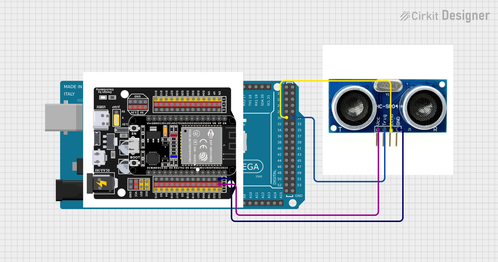

# Önvezető - vonalkövető - kisautó 🚗

**🛠️ Feladat:** Ez a projekt egy vonalkövető kisautó építéséről szól, amely képes egy előre meghatározott fekete vonalat követni a földön. A cél egy egyszerű, de jól működő robot megépítése és programozása. 🤖
**🛠️ Fő funkciók:** 
- ⚙️ A szenzorok (pl. infravörös érzékelők) segítségével a vonal érzékelése
- 🔄 A motorok vezérlése a vonal követéséhez
- 🧠 Az irányító logika (pl. Arduino kód) megírása
- 🔋 Energiaellátás biztosítása
- 🧪 Tesztelés különböző pályákon

**🎯 Cél:**
- Megbízható, folyamatos vonalkövetés
- Gyors reagálás kanyarokra és elágazásokra
- Egyszerű, áttekinthető programkód

---
**Tartalomjegyzék:**
- [Alkatrészek](#-alkatrészek)
- [Teszt](#-teszt)
- [Ultrahangos érzékelő](#ultrahangos-érzékelő-működése)
- [Osoyoo sensor](#osoyoo-sensor-működése)
- [Teljese kisautó](#a-teljes-rendszer-egyben)
- [Plusz feladat](#-extra-feladat)

---
# 🔧 Alkatrészek:

- 🚗 Félig összerakott kisautó – a váz és néhány alkatrész már a helyén van
- 📡 Ultrahangos távolságérzékelő egy 🤖 szervómotorra rögzítve – akadályok észlelésére
- 🔍 Oyoso vonalkövető sensor – már be van kötve az 🔌 Arduino vezérlőbe

---
# 🧪 Teszt:

**🔌Kapcsolási rajz:** 


> ⚠️ Figyelem: A képen látható fekete OSOYOO panel csak szemléltetés. A valóságban nem ugyanaz van beépítve.
📍 Az ultrahangos érzékelő GND és VCC lábait kell megfelelően bekötni:
- GND ➜ fekete sáv
- VCC ➜ piros sáv

🧰 Tesztkód
Készítettünk egy tesztkódot, amivel a kisautó különböző kerekeinek működését lehet kipróbálni. 🛞⚙️
A fájlokat fent le tudjátok tölteni. 📁⬇️
- CarController.cpp
- CarController.h
- ExampleProgram.ino

> 📌 A három fájlnak egy mappában kell lennie, erre figyeljetek!
▶️ Ha a .ino fájlt elindítjátok, és minden megfelelően be van kötve:
- 🔋 Kapcsoljátok be az akkumulátort a kisautón
- 🔘 A bekapcsoló gomb azon az oldalon található, ahol két kábel kilóg

---
# Ultrahangos érzékelő működése:
Ebben a készletben egy Keyes HC-SR04 ultrahangos szenzor található 🔧📏, amely képes érzékelni az előtte lévő akadályokat 🚧, valamint megállapítani a szenzor és az akadály közötti pontos távolságot 📐. A működési elve hasonló a denevérek repüléséhez 🦇.

A szenzor ultrahangos jeleket bocsát ki 🔊, amelyeket az emberek nem hallanak 🙉. Amikor ezek a jelek egy akadályba ütköznek és visszaverődnek ↩️, a szenzor érzékeli őket. A jelek kibocsátása és visszaérkezése közötti időből ⏱️ kiszámítható a távolság a szenzor és az akadály között 📏.

🔬 A kísérletben a szenzort arra használjuk, hogy megmérjük az akadály és a szenzor közötti távolságot, és az eredményt ki is íratjuk 🖥️.

Az ultrahangos érzékelő modul 2 cm–450 cm közötti érintés nélküli mérési távolságot biztosít 📏➖📏, a mérési pontossága pedig akár 3 mm is lehet 🎯, ami kiválóan megfelel a hétköznapi igényeknek ✅. A modul tartalmaz egy ultrahangos adót és vevőt, valamint a hozzájuk tartozó vezérlőáramkört ⚙️🔌.

Példakód:
````cpp
//**********************************************************************************

const int TrigPin = 31; // Trig megadása, melyik lábra van kötve
const int EchoPin = 30; // Echo megadása, melyik lábra van kötve
int duration = 0; // Állítsd be a 'duration' (időtartam) kezdeti értékét 0-ra
int distance = 0;// Állítsd be a 'distance' (távolság) kezdeti értékét 0-ra

void setup() 
{
  pinMode(TrigPin , OUTPUT); // kimeneti módba áll a TrigPin
  pinMode(EchoPin , INPUT); // bemeneti módba áll az EchoPin
  Serial.begin(9600);  // A soros monitort 9600 baud sebessége, hogy lásd a pingelés eredményét
}
void loop()
{
 // Állítsd a trigPin-t magas szintre 10 mikrosecundum (10 μs) ideig, hogy aktiváld a HC-SR04 szenzort.
  digitalWrite(TrigPin , HIGH);
  delayMicroseconds(10);
  digitalWrite(TrigPin , LOW);

  // Várd meg, amíg a HC-SR04 visszatér magas szintre, és mérd meg ezt a várakozási időt.
  duration = pulseIn(EchoPin , HIGH);

  // Számítsd ki a távolságot az idő alapján
  distance = (duration/2) / 28.5 ;
  Serial.print("Distance: ");
  Serial.print(distance); // Írasd ki a távolság értékét a soros portra.
  Serial.println("cm");
  delay(300); // Várj 100ms két pingelés között (kb 20 pings/sec).
}
//**********************************************************************************
````

---
# Osoyoo sensor működése:
**🎯 Feladat célja:** Valósíts meg egy egyszerű szenzorlogikát egy vonalkövető robothoz, amely 5 digitális infravörös érzékelő segítségével képes értelmezni a vonal pozícióját, és szövegesen visszajelez az aktuális mozgásirányról a soros monitoron keresztül.

**⚙️ Rövid leírás:** A robot 5 érzékelőt használ (balról jobbra: sr1–sr5), amelyek bináris értékeket szolgáltatnak (1 ha vonalat érzékel, 0 ha nem). A kód kiolvassa az érzékelők állapotát, majd a kapott bináris mintázat alapján meghatározza a javasolt irányt:
- Balra vagy jobbra fordulás
- Kissé balra/jobbra tartás
- Egyenes haladás
- Visszafordulás (U-turn)

**📌 Feladat részletei:** 
Érzékelők inicializálása:
- Állítsd be az 5 érzékelőt bemeneti módban a setup() függvényben.
- Indítsd el a soros kommunikációt Serial.begin(9600) paranccsal.

Érzékelőadatok beolvasása:
- Olvasd ki a digitális értékeket az 5 szenzorból.
- Alakítsd az értékeket egy 5 bites bináris mintává.
- Fordítsd meg az értéket logikailag (!digitalRead()), ha a szenzor LOW jellel jelez vonalat.

Mozgásirány meghatározása:
- A bináris érték alapján döntsd el, hogy a robotnak milyen irányba kellene mozognia.
- Írd ki az irányt a soros monitorra a Serial.println() segítségével.

Időzítés:
- Használj delay()-t a kiértékelések között a stabil működéshez.

**🧪 Tesztelési javaslatok:** Próbáld ki különböző bináris mintákra (pl. 00100, 11100, 00001, 11111), és figyeld meg, hogy a kiírt mozgásirány megfelel-e a várt viselkedésnek.

Példakód:
````cpp
#define DELAY_TIME 80 

#define sensor1 A4 // bal szenzor
#define sensor2 A3 // bal 2 szenzor
#define sensor3 A2 // középső szenzor
#define sensor4 A1 // jobb 2 szenzor
#define sensor5 A0 // jobb szenzor

void init_GPID()
{
  pinMode(sensor1, INPUT);  // bemeneti módba áll az 1. szenzor
  pinMode(sensor2, INPUT);  // bemeneti módba áll a 2. szenzor
  pinMode(sensor3, INPUT);  // bemeneti módba áll a 3. szenzor
  pinMode(sensor4, INPUT);  // bemeneti módba áll a 4. szenzor
  pinMode(sensor5, INPUT);  // bemeneti módba áll az 5. szenzor
}
void setup() {
  Serial.begin(init_GPID);
  Serial.begin(9600);
}

void loop() {
  tracking();   // nyomon követés függvénye
}

void tracking()
{
  String senstr="";
  int s0 = !digitalRead(sensor1);
  int s1 = !digitalRead(sensor2);
  int s2 = !digitalRead(sensor3);
  int s3 = !digitalRead(sensor4);
  int s4 = !digitalRead(sensor5);
  int sensorvalue=32;

  sensorvalue +=s0*16+s1*8+s2*4+s3*2+s4;

  senstr= String(sensorvalue,BIN);
  senstr=senstr.substring(1,6);

  Serial.print(senstr);
  Serial.print("\t");
 
 // A 0 és 1 itt biteket jelentenek. Ha 0 akkor nem érzékel semmit (ekkor világít a led ), ha 1 akkor érzékel
 // || - vagy reláció. Valamelyik feltételnek teljesülni kell

  // Balra fordulás
  if ( senstr=="10000" || senstr=="01000" || senstr=="11000")
  {
     Serial.println("Shift Left");
     delay(DELAY_TIME);    
  }
   
  // Balra tartás
  if ( senstr=="11100" || senstr=="10100" )
  {
     Serial.println("Slight Shift to Left");
     delay(DELAY_TIME);
  }

  // Enyhe balra tartás
  if ( senstr=="01100" ||  senstr=="11110"  || senstr=="10010"  || senstr=="10110"  || senstr=="11010")
  {
     Serial.println("Slight Left");
     delay(DELAY_TIME);
  }

  // Előre 
  if (senstr=="01110" || senstr=="01010" || senstr=="00100"  || senstr=="10001"  || senstr=="10101"  || senstr=="10011" || senstr=="11101" || senstr=="10111" || senstr=="11011"  || senstr=="11001")
  {
     Serial.println("Forward");
     delay(DELAY_TIME);
  }

  // Enyhe jobbra tartás
  if ( senstr=="00110" || senstr=="01111" || senstr=="01001" || senstr=="01011" || senstr=="01101")
  {
     Serial.println("Slit Right");
     delay(DELAY_TIME);
  }

  // Jobbra tartás
  if (senstr=="00111" || senstr=="00101" )
  {    
     Serial.println("Slight Shift to Right");
     delay(DELAY_TIME);
  }

  // Jobbra kanyarodás
  if (senstr=="00001" || senstr=="00010" || senstr=="00011")
  {
     Serial.println("Shift Right");
     delay(DELAY_TIME);
  }

  // Folyamatosan halad előre
  if (  senstr=="00000")
  {
     delay(DELAY_TIME/2*3); 
  }

  // Visszafordul
  if (  senstr=="11111")
  {
     Serial.println("Sharp Right U Turn");
     delay(DELAY_TIME);  
  }
}
````
---
# A teljes rendszer egyben:

---
# 🏆 Extra feladat:
Ha elkészült az alap projekt, és van kedved feltúrbózni, itt egy gondolkodós kihívás! 🤔

Vonalkövető kisautó építése és programozása IR kommunikációval
**📌 Feladatleírás:** A projekt célja egy önállóan működő, vonalkövető kisautó megtervezése, megépítése és programozása, amely képes követni egy fekete színű vonalat a világos felületen, és kommunikálni más eszközökkel vagy autókkal infravörös (IR) jeleken keresztül. A szükséges alkatrészeket kérjétek el tőlünk! 🤓

**🎯 A projekt célja:** Egy egyszerű, de megbízható robotautó megépítése, amely követi a földre ragasztott fekete csíkot. 
Az autó képes legyen érzékelni a vonalat, fordulni, ha letér róla, és visszatalálni. Beépíteni egy IR adó-vevőt (transmitter & receiver), amelyen keresztül az autó adatot képes küldeni vagy fogadni – például akadály észlelése, másik robot jelenléte, vagy start/stop jelzések.

**💡 Funkciók és elvárások:**
🖤 Vonalkövetés:
- A robot folyamatosan kövesse a fekete csíkot.
- Ha a robot letér a vonalról, próbáljon visszatérni.
- Érzékelők: legalább 3 szenzoros vonalkövető modul (bal–közép–jobb).

📡 IR kommunikáció:
- A robot tudjon IR jelet küldeni más eszközöknek (pl. ha akadályt észlel).
- A robot tudjon IR jelet fogadni (pl. indulás vagy megállás parancs).
- Egyszerű üzenetek továbbítása, például: START, STOP, OBSTACLE.

🧠 Programozás:
- A vezérlés Arduino környezetben történjen (C++ alapú kód).
- A program dokumentált, áttekinthető legyen.
- A soros monitoron (Serial Monitor) jelenjen meg a távolság vagy vonalkövetési állapot.

**✅ Teljesítési feltételek:**
- A robot elindul és stabilan követi a vonalat.
- Megfelelően reagál, ha letér a vonalról (korrekció).
- Az IR adó-vevő használható legalább egy alap jel küldésére/fogadására.
- A forráskód működőképes és érthető.
- Legalább egy bemutató tesztkör sikeres lefuttatása.

> Ehhez már nem adunk példakódot. Az elkészült kódot kell kiegészíteni.   
> Egy kis segítség hozzá: https://docs.keyestudio.com/projects/KS5005/en/latest/docs/Arduino/Arduino.html#projects  
> Ha pedig jobban érdekel a kisautó működése: https://osoyoo.com/2019/11/08/omni-direction-mecanum-wheel-robotic-kit-v1/
