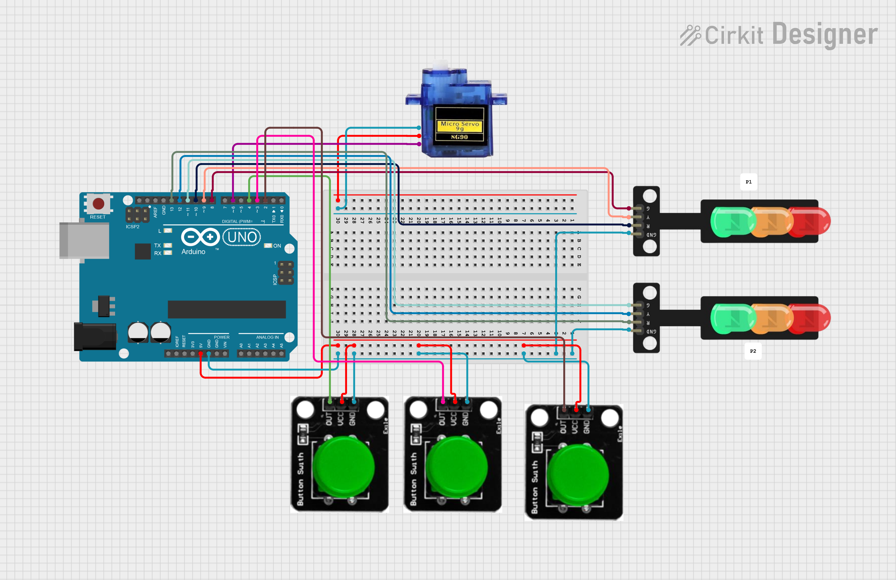
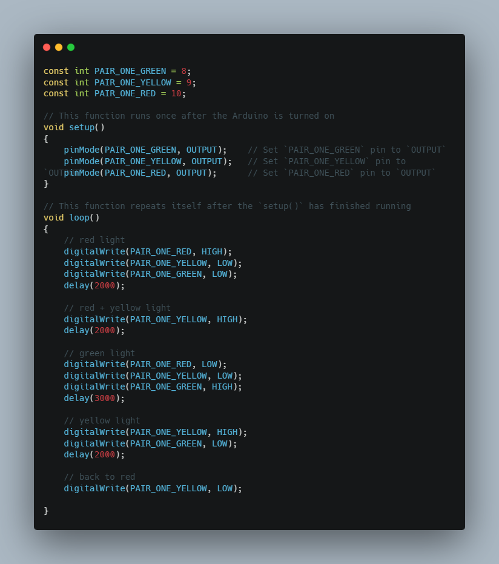
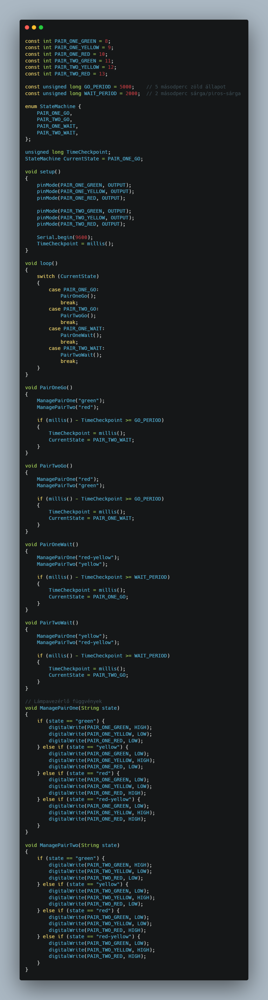
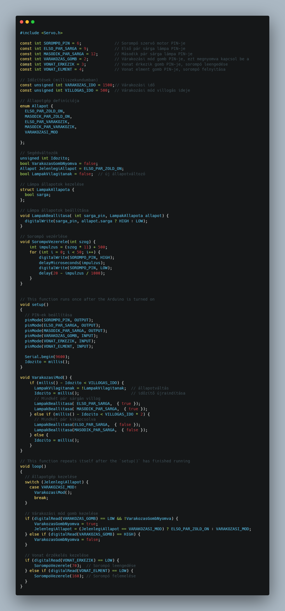

# 🚦 Közlekedés irányítása 🚗 

**🎯Feladat:** Hozz létre egy rendszert, ami képes irányítani lámpát 🏮, lámpa párokat 🔴🟢 és egy klassz sorompót 🚧

**🛠️ Fontos:** 📝 mindent a rajz alapján csináljatok, mert így biztosított a tökéletes működés. A progranban az elnevezések relatívak, nem muszáj azt használni. Ha mást használtok, akkor figyeljetek arra, hogy könnyen lehessen azonosítani az egyes vátozó neveket. 🔍

🤓 Aki foglalkozott már hasonlóval és szertne egy kicsit bonyolultabb feladaton gondolkodni annak van egy **exta feladat** a füzet végén. 📖💡

🔗 Minden feladatrész ugyanahoz a feladathoz tartozik. A feladatok között nem kell semmit átállítani, vagy megváltoztani. Ha egy feladatban egy elemet nem használsz és be van kötve attól nem lesz rossz, nem kell kivenni az alapból. 🔄✅

---

**Tartalomjegyzék:**
-   [Eszközök](#️-eszközök-amikre-szükséged-lesz)
-   [0. Feladat](#0-feladat)
-   [1. Feladat](#1-feladat)
-   [2. Feladat](#2-feladat) 
-   [3. Feladat](#3-feladat)
-   [Teljes rendszer](#a-teljes-rendszer-működtetése)
-   [Extra Feladat](#extra-feladat)

---

# 🛠️ Eszközök, amikre szükséged lesz:
-	Lámpák 🏮 ( ebből lehet 1-2 db attól függően, mennyire összetett )
-	Gomb 🔘
-	Micro servo 9g motor 🔧

---

# 0. Feladat: 
⚙️ Kapcsolási rajz: (Először ez alapján csináljátok meg a kezdő állapotot.) 

---

# 1. Feladat:
**🚥Egy pár lámpa vezérlése lépésről lépésre!**

**🛠️ Feladat:** készíts egy közlekedési lámpa szimulációt Arduino segítségével! Ebben a programban a piros, sárga és zöld LED-eket vezéreljük úgy, hogy imitálják egy közlekedési lámpa működését.  

🔹LED-ek beállítása
-	🟢 Zöld LED: Engedélyezett haladás (Pin 8)  
-	🟡 Sárga LED: Figyelmeztetés (Pin 9)  
-	🔴 Piros LED: Megállás (Pin 10)  

🚀Program működése:  
-	PIROS FÉNY🔴 (Stop!) – 2 másodpercig világít.  
-	PIROS + SÁRGA🔴🟡 (Felkészülni az indulásra!) – 1 másodpercig.  
-	ZÖLD FÉNY🟢 (Szabad az út!) – 3 másodpercig világít.  
-	SÁRGA FÉNY🟡 (Vigyázat, hamarosan piros lesz!) – 1 másodpercig.  
-	Vissza PIROSRA🔴 (Megállás újra!)  

⏳delay() függvény használatával állítjuk be az egyes lámpák időzítését.  

---

# 2. Feladat:
**🚥🚥Két lámpapár váltogatása millis()-szel**

**🛠️ Feladat:** Ebben a programban két különböző közlekedési lámpát vezérelünk, amelyek váltakozva működnek. Az egyik lámpa pirosra vált, míg a másik zöldre – és ez a ciklus ismétlődik millis() függvény segítségével!  

🔹 LED-ek beállítása  
-	🚗 Első lámpa (P1)  
-	🟢 Zöld (Pin 8) – Szabad az út!  
-	🟡 Sárga (Pin 9) - Figyelmeztetés  
-	🔴 Piros (Pin 10) – Megállás  
-	🚶 Második lámpa (P2)  
-	🟢 Zöld (Pin 11) – Szabad az út!  
-	🟡 Sárga (Pin 12) – Figyelmeztetés  
-	🔴 Piros (Pin 13) – Megállás  
 
🚀 Program működése:  
-	P1 Zöld, P2 Piros 🟢🔴 (Az egyik lámpa szabad utat ad, a másik megállít.)  
-	4 másodperc után váltás 🔄⏳  
-	P1 Piros, P2 Zöld 🔴🟢 (Most a másik lámpa engedi az áthaladást.)  
-	Ciklus folytatódik! 🔁  

⏳ millis() függvény használatával biztosítjuk a megfelelő időzítést, így pontosabb és hatékonyabb!  

---

# 3. Feladat:
**🚧Sorompó mozgatása gombbal**

**🛠️ Feladat:** Ebben a projektben egy sorompót vezérlünk két gomb segítségével! Az egyik gombbal leengedjük, a másikkal felnyitjuk a sorompót egy szervomotorral.  

🎮 Gombok:  
-	🟥 Leengedő gomb (Pin 3) – Ha megnyomod, a sorompó leereszkedik.  
-	🟩 Felnyitó gomb (Pin 4) – Ha megnyomod, a sorompó felemelkedik.  
-	🔄 Szervomotor  
-	📍 Csatlakozási pont: Pin 6  
-	🏗 Kezdeti pozíció: 160° (Fel)  

🚀 Program működése:  
-	Sorompó alaphelyzetben 📍 – Felnyitva indul (160°).  
-	Leengedés gombbal 🔻 – Ha a gomb_le megnyomódik, a sorompó 70°-ra csukódik.  
-	Felnyitás gombbal 🔺 – Ha a gomb_fel megnyomódik, a sorompó visszaáll 160°-ra.  
-	A program folyamatosan figyeli a gombokat és reagál! 🔄  

---

# A teljes rendszer működtetése:
**🚆 Teljes vasúti közlekedési rendszer vezérlése! 🚧🔄**

**🛠️ Feladat:** Egy vasúti átkelőhely működését modellezzük két közlekedési lámpa, egy sorompó és egy vonat érkezését/távozását figyelő gombok segítségével. A rendszer standby üzemmóddal is rendelkezik, amely jelzi a rendszerszünetet.  

🔹 Rendszer elemei:
-	🚥 Két közlekedési lámpa (váltakozó működéssel).
-	🚧 Sorompó szervomotorral vezérelve.
-	🚆 Vonat érkezése és távozása gombnyomásra.
-	🔄 Standby mód, amely sárga villogással jelzi a rendszerszünetet.  

🚀 Program működése:
-	Standby mód 🟡 – A gomb megnyomásával a sárga lámpák villognak, és a rendszer megáll.
-	Vonat érkezése 🚆 – A gomb megnyomásával a sorompó leereszkedik.
-	Vonat távozása 🚄 – A másik gombbal a sorompó felemelkedik.
-	Lámpák váltakozása 🚥 – Az egyik lámpa piros, a másik zöld, majd 4 másodpercenként cserélnek.
-	Automatikus időzítés ⏳ – millis() segítségével történik, így nincs delay() blokkolás.

---

# Extra feladat:
**🚀 Extra feladat 💡🔧** Ha elkészült az alap projekt, és van kedved feltúrbózni, itt egy gondolkodós kihívás! 🤔

💡 Adott egy lámpapárral 🔴🟢 és sorompóval 🚧 létrehozott rendszer. Bővítsd ki a rendszert úgy, hogy minden automatikusan működjön, emberi beavatkozás nélkül! 🔄

**✅ Gombok nélküli működés 🔘❌:** Az érkezés és távozás gombok nélkül is történjen meg, időzítés alapján. ✅ Sorompó intelligens mozgása 🚧 – Ha a lámpák pirosra váltanak, a sorompó automatikusan lecsukódjon. ✅ Villogó jelzés 🔴🟢 – A sárga lámpák automatikusan villogjanak, amikor a rendszer standby-ban van. ✅ Teljes ciklikus rendszer ⏳ – A lámpák és a sorompó folyamatosan váltakozzanak egy előre meghatározott algoritmus szerint.

**Extra nehézítés: 💭** Sorompó sebességvezérlés: Ha a piros lámpák villognak, a sorompó lassabban csukódjon le, majd stabilan záródjon. 🚀

✅ Sok sikert! 😊

