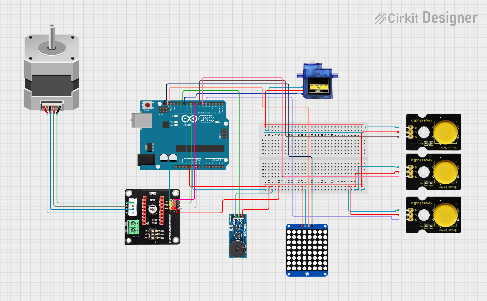

# 🛗 Lift működtetés 🚀
---

**🛗 Feladat:** Építs egy háromszintes liftet, amely egy léptetőmotor segítségével mozgatja a kabint az emeletek között! 🏢🚡 A vezérlés három nyomógombbal történik, amelyekkel kiválasztható a cél-állomás. A kabin pontos mozgatását a pozíció alapján kell vezérelni – a rendszer lineáris sín mentén dolgozik. 🔁⚙️ Minden emelet elérésekor fény- és hangjelzést kell adnia, valamint a 8x8-as LED mátrixon jelenjen meg az aktuális emeletszám és a mozgás iránya is. 💡🔊 A motor működését finomítani is lehet – például gyorsítás/lassítás hozzáadásával, hogy még valósághűbb legyen. 🐢🚀

**🛠️ Fontos:** 🧭 Minden alkatrészt pontosan a kapcsolási rajz alapján köss be! Ha máshogy nevezel el egy változót, az rendben van, de figyelj arra, hogy átlátható és jól érthető legyen a kódod. 📋✅

📌 A teljes projekt több lépésből áll, de egyetlen rendszert építünk, nem kell semmit törölni vagy átállítani, ha új funkciót adsz hozzá. 🔗 Ha valamelyik modul még nincs használva, de már be van kötve, az nem gond – hagyd nyugodtan bent! 🧠

🤓 Ha gyorsan haladsz, és szeretnél továbbgondolni a feladatot, nézd meg az extra kihívást a végén – ajtóidőzítéssel és visszaszámlálásos kijelzéssel!

---

**Tartalomjegyzék**
-   [Eszközök](#️-eszközök-amikre-szükséged-lesz)
-   [0. Feladat](#0-feladat)
-   [1. Feladat](#1-feladat)
-   [2. Feladat](#2-feladat) 
-   [3. Feladat](#3-feladat)
-   [4. Feladat](#4-feladat)
-   [Teljes rendszer](#a-teljes-rendszer-működtetése)
-   [Extra Feladat](#-extra-feladat)

---

# 🛠️ Eszközök, amikre szükséged lesz:
- Arduino UNO 🖥️⚡
- Léptetőmotor ⚙️🔄
- Motorvezérlő modul 🎛️🔌
- Lineáris sín és kabinmodell 🚠📏
- 3 db nyomógomb 🔘🔢
- 8x8 LED mátrix 🔲💡
- Végálláskapcsolók 🚫📍
- Buzzer és LED 🔊💡

---

# 0. Feladat:
⚙️ Kapcsolási rajz: (Először ez alapján csináljátok meg a kezdő állapotot.) 


---

# 1. Feladat:


---

# 🧠 2. Feladat:
## Kijelző kezelése: emeletszám és mozgásirány megjelenítése

### 🎯 Cél:
Használni egy 8x8-as LED mátrixot arra, hogy:
- **Megjelenítse az aktuális emelet számát** (0, 1, 2),
- **Mutassa a mozgás irányát** (⬆️ FEL, ⬇️ LE, ➖ áll).

A kijelző minden másodpercben frissül, és véletlenszerűen változik az emelet és az irány – ezzel tesztelhető a mátrix működése.

---

### 📟 Működés leírása

A program az `Adafruit_8x8matrix` könyvtár segítségével vezérli a kijelzőt, amely I2C kommunikációval csatlakozik (alapértelmezett cím: `0x70`).

### 🧩 Mit mutat a kijelző?

- **Szám:** a bal oldalon látható (0, 1, 2, 3).
- **Nyíl:** a jobb oldalon jelenik meg, az irány függvényében.
  - FEL: `↑`
  - LE: `↓`
  - Áll: `-` (üres nyíl)

---

### 🧠 Hogyan működik?

#### 1. Véletlenszerű értékek beállítása:
```cpp
emelet = random(0, 3);       // 0-tól 2-ig
irany = Irany(random(0, 3)); // FEL, LE, NINCS
```

2. Kijelzés rajzolása:

```cpp
matrix.displaybuffer[i + 1] = rotr((reverse(nyil[irany][i]) >> 5) | (reverse(szam[emelet][i]) >> 1));
```

Ez egy kicsit bonyolult, de ez történik:
- A szám (számjegy) és a nyíl (irány) két külön bitmátrix.
- Ezeket bitműveletekkel összefűzi egy 8x8 kijelzésre.
- A reverse() megfordítja a bájt bitek sorrendjét.
- A rotr() eltolja jobbra, hogy a szám és a nyíl ne fedje egymást.

3. Kijelző frissítése:
```cpp
matrix.writeDisplay(); // ez ténylegesen kiírja a LED mátrixra a képet
```

🔍 Minta – Emelet: 1, Irány: FEL
A kijelzőn ez fog megjelenni:

`css [ 1 ]   ↑` (Az 1-es szám bal oldalon, nyíl felfelé jobb oldalon.)

🛠️ Könyvtárhasználat
A kijelző működéséhez a következő könyvtárakra van szükség:

```cpp
#include <Adafruit_LEDBackpack.h>
#include <Adafruit_GFX.h>
```
Telepíthetők az Arduino IDE „Könyvtárkezelőjéből” `(Tools > Manage Libraries).`

## ✅ Teljes kód egyben
```cpp
// kijelző

#include <Adafruit_LEDBackpack.h>
#include <Adafruit_GFX.h>

Adafruit_8x8matrix matrix = Adafruit_8x8matrix();

long poz = 0;
long cel_poz = 0;
byte emelet = 0;
byte cel_emelet = 0;
enum Irany {
    LE,
    FEL,
    NINCS,
};
Irany irany;
enum Allapot {
    STOP,
    VARAKOZAS,
    START,
    AJTONYITAS,
    AJTO_NYITVA,
    AJTOZARAS,
    INDULAS,
    MOZGASBAN,
    ERKEZES,
};
volatile Allapot allapot;

byte reverse(byte b) {
   b = (b & 0xF0) >> 4 | (b & 0x0F) << 4;
   b = (b & 0xCC) >> 2 | (b & 0x33) << 2;
   b = (b & 0xAA) >> 1 | (b & 0x55) << 1;
   return b;
}

byte rotr(byte val) {
    return (val >> 1) | (val << 7);
}

const uint16_t szam[4][5] = {
    {
        0b00000111,
        0b00000100,
        0b00000111,
        0b00000100,
        0b00000100,
    },
    {
        0b00000010,
        0b00000110,
        0b00000010,
        0b00000010,
        0b00000010,
    },
    {
        0b00000110,
        0b00000001,
        0b00000010,
        0b00000100,
        0b00000111,
    },
    {
        0b00000000,
        0b00000000,
        0b00000111,
        0b00000000,
        0b00000000,
    },
};

const uint16_t nyil[3][5] = {
    {
        0b00000010,
        0b00000010,
        0b00000010,
        0b00000111,
        0b00000010,
    },
    {
        0b00000010,
        0b00000111,
        0b00000010,
        0b00000010,
        0b00000010,
    },
    {
        0b00000000,
        0b00000000,
        0b00000000,
        0b00000000,
        0b00000000,
    },
};

void matrix_kiir() {
    for (byte i = 0; i < 5; ++i) {
        matrix.displaybuffer[i + 1] = rotr((reverse(nyil[irany][i]) >> 5) | (reverse(szam[emelet][i]) >> 1));
    }
    matrix.writeDisplay();
}

void serial_kiir() {
    Serial.print("a: ");
    Serial.print(allapot);
    Serial.print(", e: ");
    Serial.print(emelet);
    Serial.print(", ce: ");
    Serial.print(cel_emelet);
    Serial.print(", p: ");
    Serial.print(poz);
    Serial.print(", cp: ");
    Serial.print(cel_poz);
    Serial.println();
}

void setup() {
    Serial.begin(9600);
    matrix.begin(0x70);

}

void loop() {
  emelet = random(0, 3);
  irany = Irany(random(0, 3));
  matrix_kiir();
  delay(1000);
}
```


---

# 🧠 3. Feladat:

## Ajtó működésének vezérlése gombbal

### 🎯 Cél:
Kezelni egy szervómotorral működő liftajtót úgy, hogy:
- Gombnyomás után az ajtó automatikusan **kinyíljon**,
- egy másik gombnyomás után pedig **becsukódjon**,
- miközben a rendszer figyel az állapotokra is.

### 🛠️ Működés leírása:
A program egy egyszerű **állapotgépet** használ (`STOP`, `AJTONYITAS`, `AJTO_NYITVA`, `AJTOZARAS`, stb.), ami azt jelenti, hogy a lift mindig egy adott állapotban van, és innen lép tovább a következőbe.

#### Például:
```cpp
case AJTONYITAS:
    ajtot_mozgat(170); // kinyitjuk az ajtót
    allapotot_frissit(AJTO_NYITVA); // átmegyünk a következő állapotba
    break;
```
A ajtot_mozgat(poz) függvény finoman mozgatja a szervómotort az adott pozícióra.

A gombokat INPUT_PULLUP módban használjuk, tehát logikai 0 lesz, amikor megnyomod.

Gombkezelés példa:

```cpp
for (byte i = 0; i < 3; ++i) {
    if (!digitalRead(gomb[i])) { // ha megnyomták valamelyik gombot
        allapotot_frissit(AJTOZARAS);
    }
}
Ez a logika figyeli, hogy mikor akarod becsukni az ajtót.
```


```cpp
#include <Arduino.h>
#include <Wire.h>
#include <Servo.h>

#define SERVO_PIN 11

#define DIR_PIN 10
#define STEP_PIN 9
#define EN_PIN 8

const byte gomb[3] = {5, 6, 7};

Servo ajto;
byte ajto_poz = 0;
int motor_var = 300; // motor késleltetés beállítva alapból működéshez

enum Irany {
    LE,
    FEL,
    NINCS,
};

enum Allapot {
    STOP,
    VARAKOZAS,
    START,
    AJTONYITAS,
    AJTO_NYITVA,
    AJTOZARAS,
    INDULAS,
    MOZGASBAN,
    ERKEZES,
};
volatile Allapot allapot;

Irany irany = NINCS; // globálisan deklarálva

void leptet() {
    digitalWrite(STEP_PIN, HIGH);
    delayMicroseconds(motor_var);
    digitalWrite(STEP_PIN, LOW);
    delayMicroseconds(motor_var);
}

void ajtot_mozgat(int poz) {
    ajto.attach(SERVO_PIN);
    while (ajto_poz != poz) {
        ajto_poz < poz ? ++ajto_poz : --ajto_poz;
        ajto.write(ajto_poz);
        delay(10);
    }
    delay(500);
    ajto.detach();
}

void allapotot_frissit(Allapot uj) {
    if (allapot == STOP) {
        return;
    }
    allapot = uj;
}

void iranyt_frissit(Irany uj) {
    irany = uj;
    switch (irany) {
        case FEL:
            digitalWrite(DIR_PIN, LOW);
            digitalWrite(EN_PIN, LOW);
            break;
        case LE:
            digitalWrite(DIR_PIN, HIGH);
            digitalWrite(EN_PIN, LOW);
            break;
        default:
            digitalWrite(EN_PIN, HIGH);
            break;
    }
}

void setup() {
    Serial.begin(9600);
    allapot = AJTOZARAS;

    pinMode(DIR_PIN, OUTPUT);
    pinMode(STEP_PIN, OUTPUT);
    pinMode(EN_PIN, OUTPUT);
    digitalWrite(EN_PIN, HIGH);

    // Gombok inicializálása
    for (byte i = 0; i < 3; i++) {
        pinMode(gomb[i], INPUT_PULLUP);
    }

    allapot = STOP;
}

void loop() {
    switch (allapot) {

        case VARAKOZAS:
        {
            unsigned long start = millis();
            while (!digitalRead(gomb[0])) {
                if (millis() - start > 2000) {
                    allapotot_frissit(AJTONYITAS);
                    return;
                }
            }
            break;
        }

        case AJTONYITAS:
            delay(2000);
            ajtot_mozgat(170);
            delay(2000);
            allapotot_frissit(AJTO_NYITVA);
            break;

        case AJTO_NYITVA:
            for (byte i = 0; i < 3; ++i) {
                if (!digitalRead(gomb[i])) {
                    // Itt demóként léptetünk 100 lépést felfelé
                    iranyt_frissit(FEL);
                    for (int j = 0; j < 100; j++) {
                        leptet();
                    }
                    iranyt_frissit(NINCS);
                    allapotot_frissit(AJTOZARAS);
                    break;
                }
            }
            break;

        case AJTOZARAS:
            delay(2000);
            ajtot_mozgat(10);
            allapotot_frissit(VARAKOZAS);
            delay(2000);
            break;
    }
}


```


---

# 4. Feladat:

🎯 Cél:
Mozgatni a liftkocsit léptetőmotor segítségével különböző emeletek között:
- Automatikusan indítva,
- megfelelő sebességgel,
- majd megállítani a célpozíción.

🛠️ Működés részletesen:
A mozgás több szakaszra van bontva, amit az állapotkezelés vezérel:

Fő állapotok:
- START: elindítja a kabint felfelé
- INDULAS: gyorsulási szakasz (lassan → gyorsan)
- MOZGASBAN: egyenletes mozgás
- ERKEZES: lassulási szakasz (gyorsan → lassan)

Példarészlet – Motor sebesség változtatása:
```cpp

for (long i = 0; i < atmenet; ++i) {
    motor_var = var_gyors + (1 - ((float)i / atmenet)) * (var_lassu - var_gyors);
    leptet(); // egy lépést mozgat
    poziciot_frissit(); // frissíti a pozíciót
}
```

A `motor_var` határozza meg, milyen gyorsan léptetjük a motort (delayMicroseconds).

`leptet()` = egyetlen motorlépés HIGH–LOW váltással.

`poziciot_frissit()` = a kabin aktuális pozícióját frissíti (növeli vagy csökkenti).

🧭 Irány beállítása:
```cpp
irany = FEL;
digitalWrite(DIR_PIN, LOW);  // FEL irány
digitalWrite(EN_PIN, LOW);   // Motor engedélyezve
```
📐 Emeletszám kiszámítása:
A célpozíció (cel_poz) az emeletszám szorozva az emelet_tavolsag értékkel:

```cpp
cel_emelet = 2;
cel_poz = cel_emelet * emelet_tavolsag;
```
Ez segít a rendszernek tudni, hol álljon meg a kabin.


```cpp
// szerkezet működés

#include <Arduino.h>
#include <Wire.h>
#include <Servo.h>

#define CS_PIN 2
#define DIR_PIN 10
#define STEP_PIN 9
#define EN_PIN 8

const int var_gyors = 200;
const int var_lassu = 400;
int motor_var = 300;

long poz = 0;
long cel_poz = 0;
long frissit = 0;
const long emelet_tavolsag = 30000;
const long atmenet = 3000;

byte emelet = 0;
byte cel_emelet = 0;

enum Irany {
    LE,
    FEL,
};
Irany irany;

enum Allapot {
    STOP,
    VARAKOZAS,
    START,
    AJTONYITAS,
    AJTO_NYITVA,
    AJTOZARAS,
    INDULAS,
    MOZGASBAN,
    ERKEZES,
};
volatile Allapot allapot;

void leptet() {
    digitalWrite(STEP_PIN, HIGH);
    delayMicroseconds(motor_var);
    digitalWrite(STEP_PIN, LOW);
    delayMicroseconds(motor_var);
}

void allapotot_frissit(Allapot uj) {
    if (allapot == STOP) {
        return;
    }
    allapot = uj;
}

void stop() {
    if (allapot == START) {
        return;
    }
    allapot = STOP;
}

void poziciot_frissit() {
    switch (irany) {
        case FEL:
            ++poz;
            break;
        case LE:
            --poz;
            break;
    }
}

void emeletet_frissit_indulaskor() {
    frissit = poz;
    switch (irany) {
        case FEL:
            frissit += emelet_tavolsag / 2;
            break;
        case LE:
            frissit -= emelet_tavolsag / 2;
            break;
    }
}

void emeletet_frissit() {
    if (poz != frissit) {
        return;
    }
    switch (irany) {
        case FEL:
            ++emelet;
            frissit += emelet_tavolsag;
            break;
        case LE:
            --emelet;
            frissit -= emelet_tavolsag;
            break;
    }
}

void setup() {
    Serial.begin(9600);
    Serial.println();
    Serial.println("Setup started");

    pinMode(DIR_PIN, OUTPUT);
    pinMode(STEP_PIN, OUTPUT);
    pinMode(EN_PIN, OUTPUT);
    digitalWrite(EN_PIN, HIGH); // motor letiltva induláskor

    attachInterrupt(digitalPinToInterrupt(CS_PIN), stop, FALLING);

    allapot = STOP;

    Serial.println("Setup completed");
}

void loop() {
    switch (allapot) {
        case STOP:
            emelet = 3;
            Serial.println("Stop");
            delay(1000);
            allapot = VARAKOZAS;
            break;

        case VARAKOZAS:
            // Ide kerülhetne majd gombkezelés, de most csak szimuláljuk az indulást
            Serial.println("Varakozas...");
            delay(1000);
            allapotot_frissit(START);
            break;

        case START:
            emelet = 3;
            irany = FEL;
            digitalWrite(DIR_PIN, LOW);  // FEL irány = LOW
            digitalWrite(EN_PIN, LOW);   // Engedélyezzük a motort

            delay(4000);
            motor_var = 300;

            poz = 0;
            emelet = 0;
            cel_emelet = 2;
            cel_poz = cel_emelet * emelet_tavolsag;

            emeletet_frissit_indulaskor();

            allapotot_frissit(INDULAS);
            break;

        case INDULAS:
            for (long i = 0; i < atmenet; ++i) {
                motor_var = var_gyors + (1 - ((float)i / atmenet)) * (var_lassu - var_gyors);
                leptet();
                poziciot_frissit();
                if (allapot == STOP) {
                    return;
                }
            }
            allapotot_frissit(MOZGASBAN);
            break;

        case MOZGASBAN:
            motor_var = var_gyors;
            while (abs(cel_poz - poz) > atmenet) {
                leptet();
                poziciot_frissit();
                emeletet_frissit();
                if (allapot == STOP) {
                    return;
                }
            }
            allapotot_frissit(ERKEZES);
            break;

        case ERKEZES:
            for (long i = 0; i < atmenet; ++i) {
                motor_var = var_gyors + ((float)i / atmenet) * (var_lassu - var_gyors);
                leptet();
                poziciot_frissit();
                if (allapot == STOP) {
                    return;
                }
            }
            digitalWrite(EN_PIN, HIGH); // letiltjuk a motort érkezés után
            Serial.println("Erkezes.");
            allapot = STOP;
            break;
    }
}


```


---

# Teljes rendszer
**A teljes liftvezérlő rendszer vezérlése**🚀

📌 Feladatleírás: A projekt célja egy liftmodell létrehozása, amely három emelet között mozgat egy kabint léptetőmotor segítségével. 🚀

🛗 Rendszer elemei:
- Léptetőmotor ( NEMA 17 ) ⚙️🔄
- Motorvezérlő modul ( A4988 vagy ULN2003 ) 🎛️🔌
- Lineáris sín és kabinmodell 🚠📏
- 3 db nyomógomb (  emeletválasztáshoz) 🔘🔢
- 8x8 LED mátrix ( emeletszám kijelzéshez ) 🔲💡
- Végálláskapcsolók ( referenciapont érzékeléshez ) 🚫📍
- Buzzer és LED ( jelzésekhez ) 🔊💡

🚀 Program működése:
- Emeletválasztás: A felhasználó három nyomógombbal választhatja ki a kívánt emeletet 🏠🔘🏠 
- Pozícióvezérlés: A rendszer léptetőmotor segítségével mozgatja a kabint a lineáris sínen ⚙️📏 
- LED Mátrix kijelzés: Az aktuális emeletszám és mozgásirány a 8x8 LED mátrixon jelenik meg 📟💡 
- Ajtó működése: A kabin ajtaja egy szervomotorral nyílik és záródik 🚪🔄 
- Hang- és fényjelzés: Minden emelet elérésekor buzzer és LED figyelmezteti a felhasználót 🔊✨ 
- Motorvezérlés finomhangolása: A gyorsítás/lassítás fokozatosan történik 🚀🐢

---

### **🏆 Extra feladat:**  
**🛠️ Extra feladat:** Ha elkészült az alap projekt, és van kedved feltúrbózni, itt egy gondolkodós kihívás! 🤔

**📌 Időzített ajtónyitás és automatikus visszazárás:** A lift ajtaja ne csak manuálisan nyíljon és záródjon, hanem időzített módon működjön, és figyelje, hogy egy bizonyos idő elteltével automatikusan bezáródjon.


**🏆 Extra kihívás:** 👀 Jelenítsd meg a visszaszámlálást a LED kijelzőn – a hátralévő másodperceket mutassa! 

✅ Sok sikert! 😊

