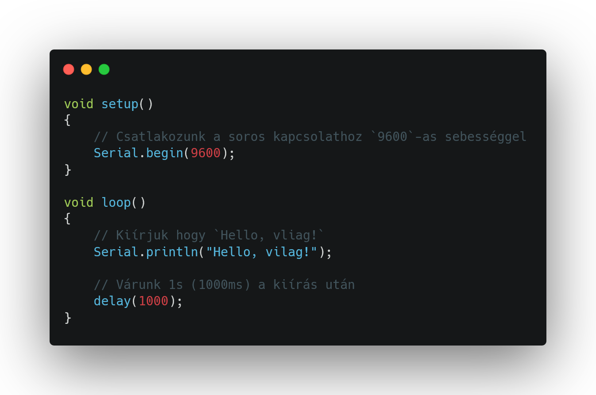
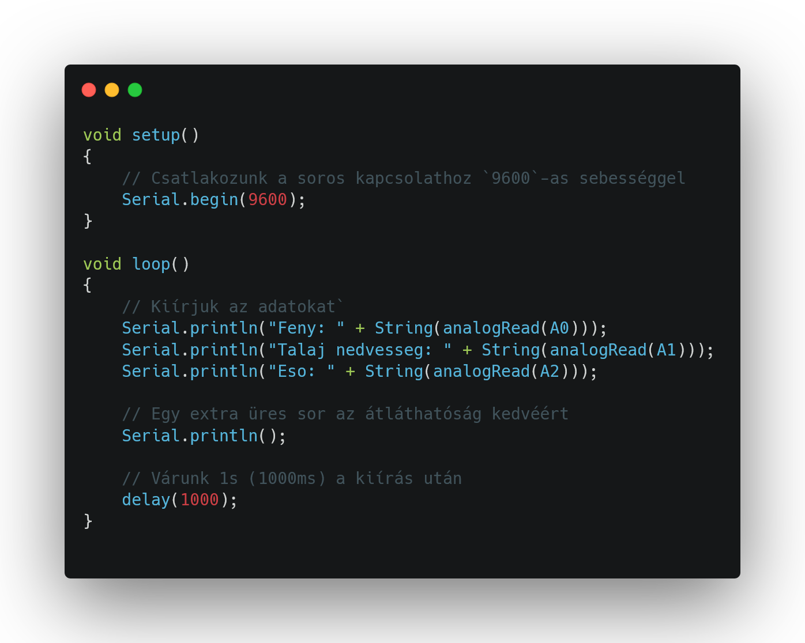

# Növénygondozó 🌱🧑‍🌾
 
**🛠️ Fontos:** 📝 mindent a rajz alapján csináljatok, mert így biztosított a tökéletes működés. A progranban az elnevezések relatívak, nem muszáj azt használni. Ha mást használtok, akkor figyeljetek arra, hogy könnyen lehessen azonosítani az egyes vátozó neveket. 🔍

🤓 Aki foglalkozott már hasonlóval és szertne egy kicsit bonyolultabb feladaton gondolkodni annak van egy **exta feladat** a füzet végén. 📖💡

🔗 Minden feladatrész ugyanahoz a feladathoz tartozik. A feladatok között nem kell semmit átállítani, vagy megváltoztani. Ha egy feladatban egy elemet nem használsz és be van kötve attól nem lesz rossz, nem kell kivenni az alapból. 🔄✅

---
**Tartalomjegyzék:**
-   [Eszközök](#️-eszközök-amikre-szükséged-lesz)
-   [1. Feladat](#1-feladat)
-   [2. Feladat](#2-feladat) 
-   [3. Feladat](#3-feladat)
-   [4. Feladat](#4-feladat)
-   [5. Feladat](#5-feladat)
-   [Teljes rendszer](#teljes-rendszer)
-   [Extra Feladat](#-extra-feladat)

---

# 🛠️ Eszközök, amikre szükséged lesz:
- 📡 Arduino MKR1000
- 🌱 Soil Humidity Sensor 
- 💧 Water Sensor 
- 💡 TEMT6000 Light Sensor 
- 🔦 Power LED
- 🚰 Szivattyú + 12V relay
- 🌀 MMA8452Q gyorsulásérzékelő
- 🌐 WiFi webes vezérlés – 🔘 ki/bekapcsoló gombok a világításhoz és szivattyúhoz

---

# 1. Feladat: 
Mielőtt bármi mást csinálnánk, először működésre kell bírnunk az Arduinót ⚙️. Az MKR 1000 nem indul be olyan egyszerűen, mint egy sima UNO 🔌, de ne aggódj – ez sem sokkal bonyolultabb 😌.

Mindössze egy csomagot kell letöltened az Arduino IDE-n belül 💻:
1. A bal oldali menüben válaszd ki a `Boards Manager` opciót 🧰.
2. Keresd meg a következőt: 🔍 `Arduino SAMD Boards (32-bits ARM Cortex-M0+)`
3. Telepítsd azt, amelyiknél az van írva, hogy `by Arduino` ✅.

Ha ez megvan, akkor a megszokott módon töltsd fel az alábbi kódot 📥, majd figyeld a soros monitort 🖥️, hogy megjelenik-e a megfelelő szöveg 🧐.



Ezt kellene látnod a soros kapcsolat ablakában 🖥️, ha minden megfelelően működik 👇:

```
Hello, vilag!
Hello, vilag!
Hello, vilag!
```

---

# 2. Feladat: 

Ha már biztosan tudjuk, hogy működik az eszköz ✅, akkor elkezdhetünk szenzorokat csatlakoztatni hozzá 🔌.

Ebben a feladatban minden érzékelőt be fogunk kötni:
- 🌱 talajnedvesség-érzékelő
- 🌧️ esőérzékelő
- ☀️ fényérzékelő

Ezután egy tesztkóddal 🧪 ellenőrizzük, hogy mindegyik megfelelően működik.



Ezt kellene látnod a soros kapcsolat ablakában 🖥️, ha minden megfelelően működik 👇:

```
Feny: 69
Talaj nedvesseg: 0
Eso: 0
```

---

# 3. Feladat: 

---

# 4. Feladat: 

---

# 5. Feladat: 

---

# Teljes rendszer
**A teljes növénygondozó vezérlése** 

**🧠 Feladatleírás:** Készíts egy automatikusan működő öntöző- és fénykiegészítő rendszert, amely figyeli a növény környezeti állapotát:
- 🌞 fényerősség
- 🌱 talajnedvesség
- ☔ eső jelenléte

Az érzékelt adatokat a rendszer 📶 WiFi-n keresztül továbbítja egy weboldalra. A felhasználó ezt a weboldalt mobiltelefonról is eléri, és a következő funkciókat vezérelheti:

**🛠️ Eszközök:** 
- 📡 Arduino MKR1000
- 🌱 Soil Humidity Sensor ( talajnedvesség-érzékelő )
- 💧 Water Sensor ( esőérzékelő )
- 💡 TEMT6000 Light Sensor ( fényérzékelő )
- 🔦 Power LED
- 🚰 Szivattyú + 12V relay
- 🌀 MMA8452Q gyorsulásérzékelő ( opcionális )
- 🌐 WiFi webes vezérlés – 🔘 ki/bekapcsoló gombok a világításhoz és szivattyúhoz

**🧰 Funkciók:**
- 🚿 Szivattyú vezérlése relén keresztül (BE / KI)
- 💡 Nagy fényerejű LED világítás vezérlése (BE / KI)
- 🔁 Automatikus üzemmód, amely a szenzorértékek alapján kapcsolja a pumpát és a lámpát
- 🌐 Webes felület vezérlőgombokkal mobilon is elérhető

**📲 Webes vezérlés funkciói:**
A rendszer tartalmaz egy beépített webkiszolgálót, amelyen keresztül a következőket lehet vezérelni:

**💡 Lámpa vezérlés:**
- ✅ Lámpa bekapcsolása
- ❌ Lámpa kikapcsolása
- 🔁 Automatikus lámpavezérlés (fényérzékelő alapján)

**🚿 Szivattyú vezérlés:**
- ✅ Szivattyú bekapcsolása
- ❌ Szivattyú kikapcsolása
- 🔁 Automatikus öntözés (talaj és eső alapján)

---

# **🏆 Extra feladat:**  
**🛠️ Extra feladat:** Ha elkészült az alap projekt, és van kedved feltúrbózni, itt egy gondolkodós kihívás! 🤔

📈 1. Érzékelt értékek megjelenítése a weboldalon
➡️ Jelenítsd meg a webfelületen az aktuális mért értékeket:
- 🌞 Fényintenzitás (LightValue)
- 🌱 Talajnedvesség (SoilValue)
- ☔ Esőérzékelés (RainValue)

🕒 2. Időzített működés bevezetése
➡️ Állítsd be, hogy a szivattyú vagy a lámpa csak adott időintervallumban működhessen (pl. reggel 6 és este 8 között). Ehhez használhatod az millis() függvényt vagy egy egyszerű időszimulációt.

✅ Sok sikert! 😊
