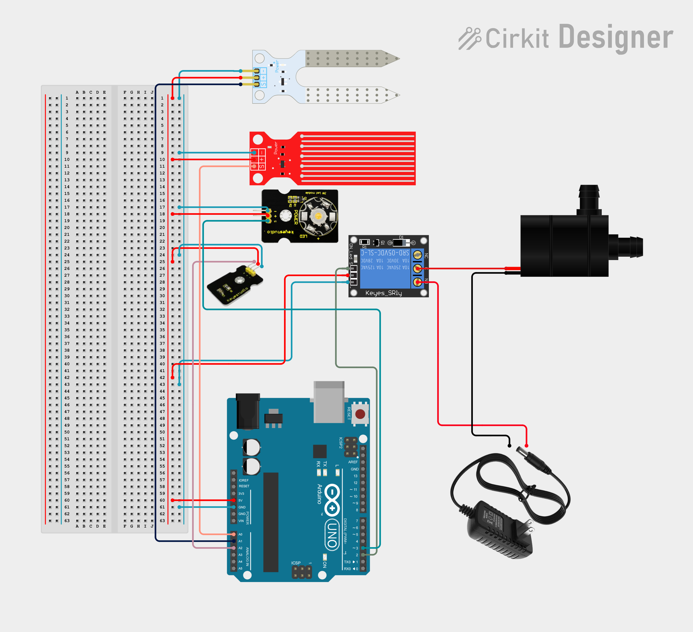
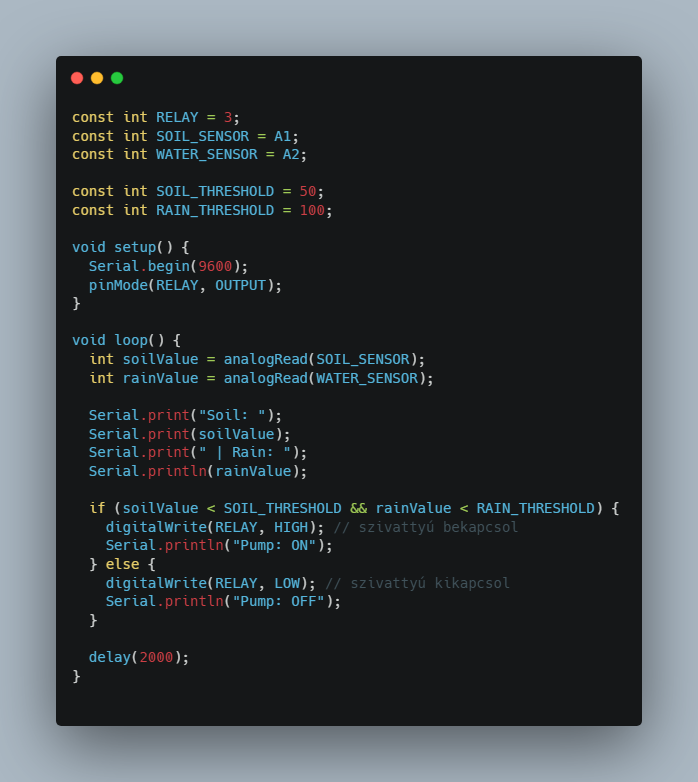
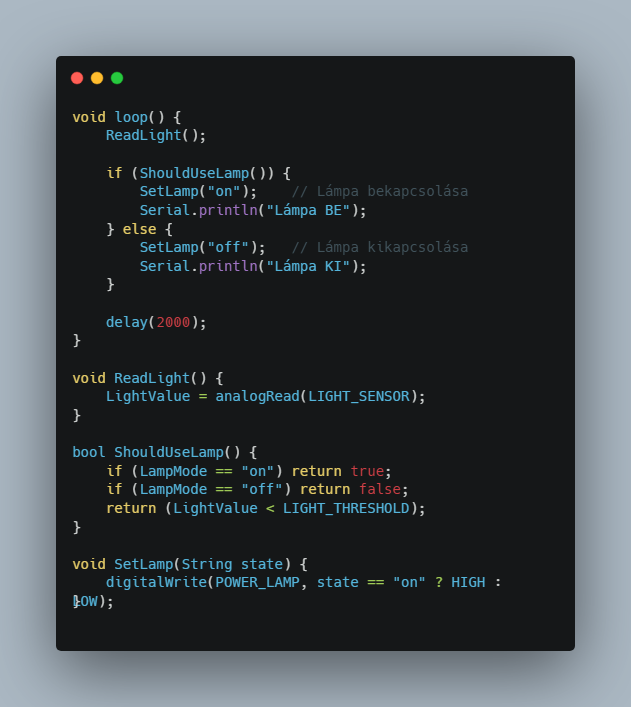
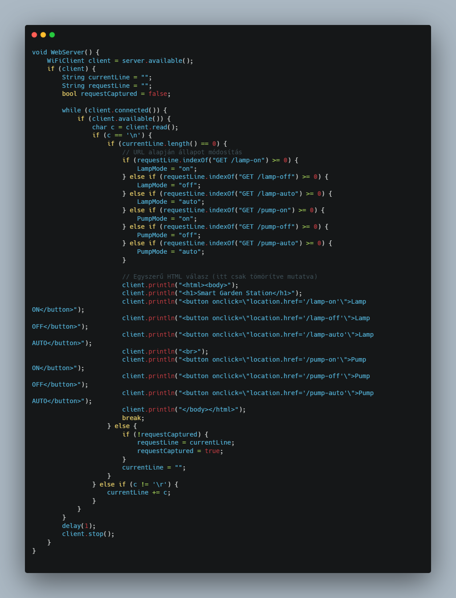

# Növénygondozó 🌱🧑‍🌾
 
**🛠️ Fontos:** 📝 mindent a rajz alapján csináljatok, mert így biztosított a tökéletes működés. A progranban az elnevezések relatívak, nem muszáj azt használni. Ha mást használtok, akkor figyeljetek arra, hogy könnyen lehessen azonosítani az egyes vátozó neveket. 🔍

🤓 Aki foglalkozott már hasonlóval és szertne egy kicsit bonyolultabb feladaton gondolkodni annak van egy **exta feladat** a füzet végén. 📖💡

🔗 Minden feladatrész ugyanahoz a feladathoz tartozik. A feladatok között nem kell semmit átállítani, vagy megváltoztani. Ha egy feladatban egy elemet nem használsz és be van kötve attól nem lesz rossz, nem kell kivenni az alapból. 🔄✅

---
**Tartalomjegyzék:**
-   [Eszközök](#️-eszközök-amikre-szükséged-lesz)
-   [0. Feladat](#0-feladat)
-   [1. Feladat](#1-feladat)
-   [2. Feladat](#2-feladat) 
-   [3. Feladat](#3-feladat)
-   [Teljes rendszer](#a-teljes-rendszer-működtetése)
-   [Extra Feladat](#extra-feladat)

---

# 🛠️ Eszközök, amikre szükséged lesz:
- 📡 Arduino MKR1000
- 🌱 Soil Humidity Sensor 
- 💧 Water Sensor 
- 💡 TEMT6000 Light Sensor 
- 🔦 Power LED
- 🚰 Szivattyú + 12V relay
- 🌀 MMA8452Q gyorsulásérzékelő
- 🌐 WiFi webes vezérlés – 🔘 ki/bekapcsoló gombok a világításhoz és szivattyúhoz

---

# 0. Feladat:
⚙️ Kapcsolási rajz: (Először ez alapján csináljátok meg a kezdő állapotot.) 

---

# 1. Feladat: 
🌱 Talajnedvesség és eső érzékelése, szivattyú vezérlése

Feladatleírás:
🌱💧 Olvasd be a talajnedvesség és eső érzékelő értékeit, és döntsd el, hogy szükséges-e bekapcsolni a szivattyút.
💦🚫 A szivattyú akkor kapcsoljon be, ha a talajnedvesség alacsony (SOIL_THRESHOLD alatt van), és nincs eső (RAIN_THRESHOLD alatt van az esőérzékelő értéke).

Magyarázat:
- 🤖🔌 A ShouldUsePump() függvény ezt a logikát valósítja meg:
- 🔛 Ha manuálisan "on"-ra van állítva, akkor mindig be van kapcsolva a szivattyú.
- ⏹ Ha manuálisan "off"-ra van állítva, akkor mindig ki van kapcsolva.
- 🔄 Ha "auto" módban van, akkor a talajnedvesség és esőérték alapján dönt.

---

# 2. Feladat: 
💡 Automatikus fényérzékelés és lámpa vezérlés

Feladatleírás:
💡📏 Olvasd be a fényérzékelő értékét, és kapcsolj lámpát akkor, ha a fényerő az előre beállított küszöbérték (LIGHT_THRESHOLD) alá esik. A lámpa szintén lehet manuális "on" ▶️ vagy "off" ⏹ állapotban, vagy automata 🔄.

Magyarázat:
🤖🔍 A ShouldUseLamp() függvény kezeli a döntést. Manuális módban mindig az adott állapotot adja vissza, automata módban pedig a fényértéket hasonlítja a küszöbértékhez. ⚖️💡

---

# 3. Feladat: 
🌐 Egyszerű webes vezérlés pumpa és lámpa számára

🌐📶 A WiFi-hez csatlakozott eszköz webkiszolgálót futtat, amelyen keresztül böngészőből állítható a pumpa 💧 és a lámpa 💡 működési módja (on ▶️, off ⏹, auto 🔄). A weboldalon három gomb található mindkét eszköz számára.

Magyarázat:
🖥️📲 A WebServer() függvény várja a kliens kapcsolatot, majd az URL alapján módosítja a PumpMode és LampMode változókat. Ezáltal a loop()-ban futó logika az új állapot szerint működik tovább. 🔄⚙️

---

# Teljes rendszer
**A teljes növénygondozó vezérlése** 

**🧠 Feladatleírás:** Készíts egy automatikusan működő öntöző- és fénykiegészítő rendszert, amely figyeli a növény környezeti állapotát:
- 🌞 fényerősség
- 🌱 talajnedvesség
- ☔ eső jelenléte

Az érzékelt adatokat a rendszer 📶 WiFi-n keresztül továbbítja egy weboldalra. A felhasználó ezt a weboldalt mobiltelefonról is eléri, és a következő funkciókat vezérelheti:

**🛠️ Eszközök:** 
- 📡 Arduino MKR1000
- 🌱 Soil Humidity Sensor ( talajnedvesség-érzékelő )
- 💧 Water Sensor ( esőérzékelő )
- 💡 TEMT6000 Light Sensor ( fényérzékelő )
- 🔦 Power LED
- 🚰 Szivattyú + 12V relay
- 🌀 MMA8452Q gyorsulásérzékelő ( opcionális )
- 🌐 WiFi webes vezérlés – 🔘 ki/bekapcsoló gombok a világításhoz és szivattyúhoz

**🧰 Funkciók:**
- 🚿 Szivattyú vezérlése relén keresztül (BE / KI)
- 💡 Nagy fényerejű LED világítás vezérlése (BE / KI)
- 🔁 Automatikus üzemmód, amely a szenzorértékek alapján kapcsolja a pumpát és a lámpát
- 🌐 Webes felület vezérlőgombokkal mobilon is elérhető

**🛡️ Opcionális bővítés:**
- 📦 Mozgásérzékelés gyorsulásérzékelővel (például lopásérzékelés céljából)

**📲 Webes vezérlés funkciói:**
A rendszer tartalmaz egy beépített webkiszolgálót, amelyen keresztül a következőket lehet vezérelni:

**💡 Lámpa vezérlés:**
- ✅ Lámpa bekapcsolása
- ❌ Lámpa kikapcsolása
- 🔁 Automatikus lámpavezérlés (fényérzékelő alapján)

**🚿 Szivattyú vezérlés:**
- ✅ Szivattyú bekapcsolása
- ❌ Szivattyú kikapcsolása
- 🔁 Automatikus öntözés (talaj és eső alapján)

### **🏆 Extra feladat:**  
**🛠️ Extra feladat:** Ha elkészült az alap projekt, és van kedved feltúrbózni, itt egy gondolkodós kihívás! 🤔

📈 1. Érzékelt értékek megjelenítése a weboldalon
➡️ Jelenítsd meg a webfelületen az aktuális mért értékeket:
- 🌞 Fényintenzitás (LightValue)
- 🌱 Talajnedvesség (SoilValue)
- ☔ Esőérzékelés (RainValue)

🕒 2. Időzített működés bevezetése
➡️ Állítsd be, hogy a szivattyú vagy a lámpa csak adott időintervallumban működhessen (pl. reggel 6 és este 8 között). Ehhez használhatod az millis() függvényt vagy egy egyszerű időszimulációt.

✅ Sok sikert! 😊
