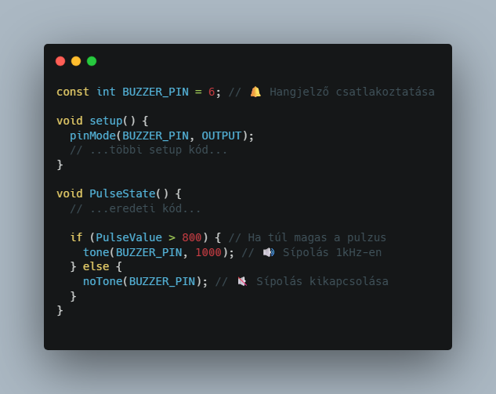

# Okosóra ⌚

A projekt célja egy olyan hordozható egészségügyi monitor megvalósítása, amely képes az emberi pulzusszám, testhőmérséklet és alkoholszint mérésére. Az értékek egy 240x240 pixel felbontású, kör alakú SPI kijelzőn jelennek meg, letisztult felületen. A felhasználó egy rotary encoder segítségével tud navigálni a menüpontok között, így egyszerre csak egy mérés (pulzus, hőmérséklet vagy alkoholszint) eredménye jelenik meg a kijelzőn. A rendszer célja az adatok könnyen értelmezhető, kényelmes megjelenítése, és a szenzorhasználat gyakorlása valós alkalmazásban.

**🛠️ Fontos:** 📝 mindent a rajz alapján csináljatok, mert így biztosított a tökéletes működés. A progranban az elnevezések relatívak, nem muszáj azt használni. Ha mást használtok, akkor figyeljetek arra, hogy könnyen lehessen azonosítani az egyes vátozó neveket. 🔍

🤓 Aki foglalkozott már hasonlóval és szertne egy kicsit bonyolultabb feladaton gondolkodni annak van egy **exta feladat** a füzet végén. 📖💡

🔗 Minden feladatrész ugyanahoz a feladathoz tartozik. A feladatok között nem kell semmit átállítani, vagy megváltoztani. Ha egy feladatban egy elemet nem használsz és be van kötve attól nem lesz rossz, nem kell kivenni az alapból. 🔄✅

---
**Tartalomjegyzék:**
-   [Eszközök](#️-eszközök-amikre-szükséged-lesz)
-   [0. Feladat](#0-feladat)
-   [1. Feladat](#1-feladat)
-   [2. Feladat](#2-feladat) 
-   [3. Feladat](#3-feladat)
-   [4. Feladat](#4-feladat)
-   [Teljes rendszer](#a-teljes-rendszer-működtetése)
-   [Extra Feladat](#extra-feladat)

---

# 🛠️ Eszközök, amikre szükséged lesz:
- 🧠 Arduino Mega
- ❤️‍🩹 MAX30100 pulzusmérő szenzor
- 🌡️ Hőmérséklet-érzékelő
- 🍷 MQ-3 alkoholérzékelő
- 🖼️ 240x240 pixel kör alakú SPI TFT kijelző
- 🔄 Rotary Encoder

---

# 0. Feladat:
⚙️ Kapcsolási rajz: Ezt ebben a feladatban megcsináltuk már nektek. Óratosan vegyétek ki a dobozból, nehogy valamit kihúzzatok!

---

# 1. Feladat:

---

# 2. Feladat:

---

# 3. Feladat:

---

# 4. Feladat:

---

# Teljes rendszer
**A teljes okosóra vezérlése** 

🛠️ Eszközök:
- 🧠 Arduino Mega
- ❤️‍🩹 MAX30100 vagy hasonló pulzusmérő szenzor
- 🌡️ Hőmérséklet-érzékelő ( DS18B20 vagy LM35 )
- 🍷 MQ-3 alkoholérzékelő
- 🖼️ 240x240 pixel kör alakú SPI TFT kijelző
- 🔄 Rotary Encoder ( menünavigációhoz )

### **🏆 Extra feladat:**  
**🛠️ Extra feladat:** Ha elkészült az alap projekt, és van kedved feltúrbózni, itt egy gondolkodós kihívás! 🤔

✅ Sok sikert! 😊
