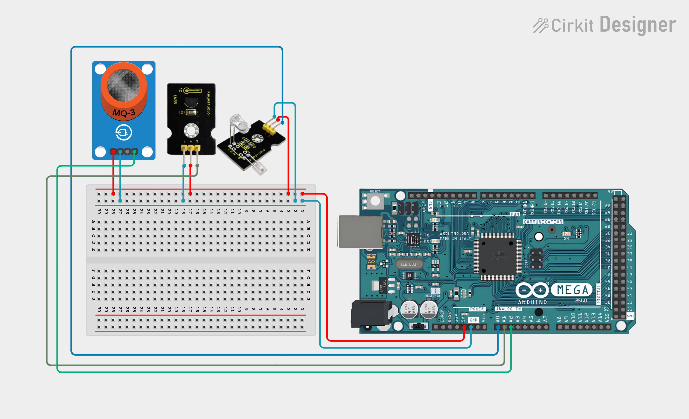
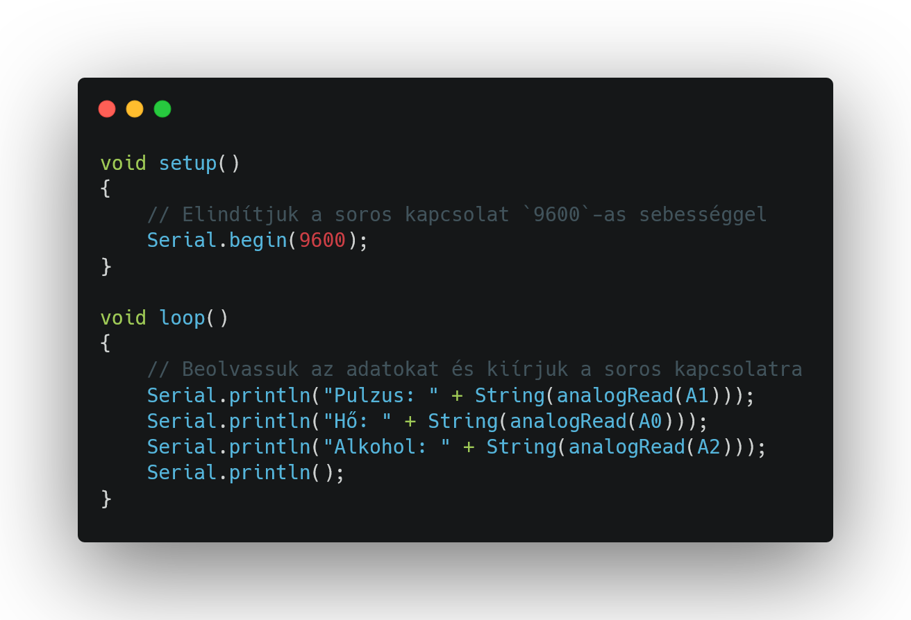
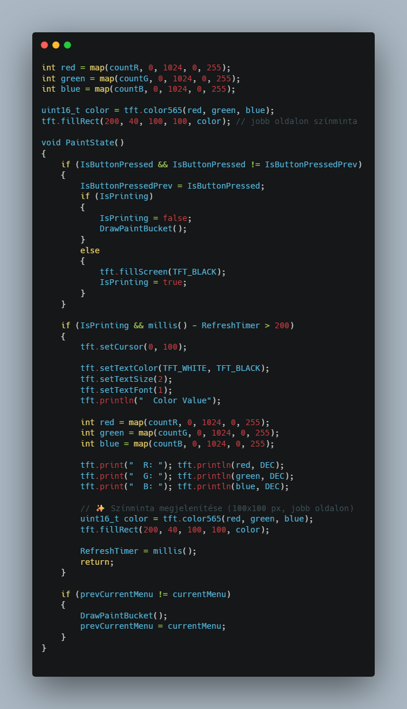
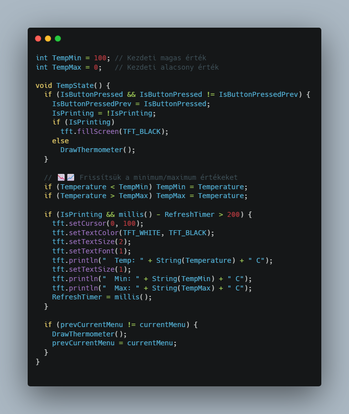
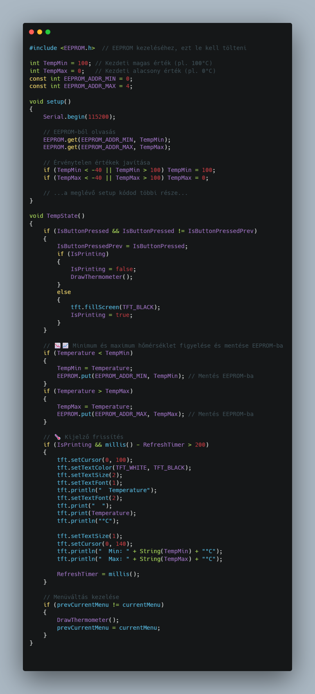

# Okosóra ⌚

**🛠️ Fontos:** 📝 mindent a rajz alapján csináljatok, mert így biztosított a tökéletes működés. A progranban az elnevezések relatívak, nem muszáj azt használni. Ha mást használtok, akkor figyeljetek arra, hogy könnyen lehessen azonosítani az egyes vátozó neveket. 🔍

🤓 Aki foglalkozott már hasonlóval és szertne egy kicsit bonyolultabb feladaton gondolkodni annak van egy **exta feladat** a füzet végén. 📖💡

🔗 Minden feladatrész ugyanahoz a feladathoz tartozik. A feladatok között nem kell semmit átállítani, vagy megváltoztani. Ha egy feladatban egy elemet nem használsz és be van kötve attól nem lesz rossz, nem kell kivenni az alapból. 🔄✅

---
**Tartalomjegyzék:**
-   [Eszközök](#️-eszközök-amikre-szükséged-lesz)
-   [1. Feladat](#1-feladat)
-   [2. Feladat](#2-feladat) 
-   [3. Feladat](#3-feladat)
-   [4. Feladat](#4-feladat)
-   [Teljes rendszer](#teljes-rendszer)
-   [Extra Feladat](#-extra-feladat)

---

# 🛠️ Eszközök, amikre szükséged lesz:
- 🧠 Arduino Mega
- ❤️‍🩹 MAX30100 pulzusmérő szenzor
- 🌡️ Hőmérséklet-érzékelő
- 🍷 MQ-3 alkoholérzékelő
- 🖼️ 240x240 pixel kör alakú SPI TFT kijelző
- 🎨 Színérzékelő
- 🔄 Rotary Encoder

---

# 1. Feladat:
Ebben a feladatban csatlakoztatni fogjuk az első három szenzort: a hőmérséklet 🌡️, az alkohol 🍷 és a pulzusmérő ❤️ szenzort. Ezután feltöltünk egy olyan programot az Arduinóra 🤖, amely segít leellenőrizni, hogy mindent jól kötöttünk-e be ✅.





Ha mindent jól csináltunk, akkor egy ehhez hasonló kiírást kellene kapnunk a soros monitoron 🖥️👇:

```txt
Pulzus: 993
Hő: 44
Alkohol: 138
```

---

# 2. Feladat:
🎨 Színminta megjelenítése
**🎯 Feladat:** A színérzékelő adatai alapján színezd be a kijelző egy részét az érzékelt RGB színnel.

**💡 Magyarázat:**
A `countR`, `countG`, `countB` értékeket leképezzük 0-255 tartományra és ezzel kitöltünk egy négyzetet.



---

# 3. Feladat:
💾 Minimum & maximum értékek tárolása
**🎯 Feladat:** Mutassa a hőmérséklet szenzor által mért minimum és maximum értékeket a képernyőn.

**💡 Magyarázat:**
Egyszerű változókban eltároljuk a legalacsonyabb és legmagasabb mért értéket, és ezek frissülnek, ha új csúcsértékek érkeznek.



---

# 4. Feladat:
🔄 Automatikus mentés EEPROM-ba (minimum és maximum hőmérséklet)
**🎯 Feladat:** A program indításkor töltse be az EEPROM-ból az előzőleg eltárolt hőmérsékleti minimum és maximum értékeket, és új érték esetén mentse vissza.

**💡 Magyarázat:**
Az Arduino EEPROM memóriája megőrzi az adatokat a kikapcsolás után is. Így a hőmérsékletcsúcsokat nem veszítjük el újraindításkor.



**📌 Megjegyzés:**
- Az EEPROM írása korlátozott (~100,000 ciklus/cím), ezért érdemes nem minden apró változást menteni, csak ha valóban új csúcsérték születik (ami itt így is van).
- Ha bővíteni szeretnéd, egy hosszú gombnyomásra például resetelheti az EEPROM-ot.

---

# Teljes rendszer
**A teljes okosóra - egészségügyi monitor vezérlése** 

**🧠 Cél:** A projekt célja egy hordozható egészségügyi monitor megvalósítása, amely az alábbi három élettani adat mérésére képes:
- ❤️ Pulzusszám
- 🌡️ Testhőmérséklet
- 🍷 Alkoholszint

**📺 Kijelző:**
Az értékek egy 240x240 pixel felbontású, kör alakú SPI kijelzőn jelennek meg, letisztult, felhasználóbarát felületen.

**🎛️ Vezérlés:**
A felhasználó egy rotary encoder (forgatható nyomógomb) segítségével menüpontok között navigál, és egyszerre csak egy mért érték jelenik meg a kijelzőn, hogy az adatok könnyen értelmezhetők legyenek.

**🛠️ Működési elv:**
- 🔄 A rotary encoder forgatásával választható ki a mérendő adat.
- 📊 A kiválasztott szenzor bekapcsol, és a mért érték megjelenik a kijelzőn.
- 💾 A rendszer akár bővíthető is adatnaplózással vagy Bluetooth-kommunikációval.

**🛠️ Eszközök:**
- 🧠 Arduino Mega
- ❤️‍🩹 MAX30100 vagy hasonló pulzusmérő szenzor
- 🌡️ Hőmérséklet-érzékelő ( DS18B20 vagy LM35 )
- 🍷 MQ-3 alkoholérzékelő
- 🖼️ 240x240 pixel kör alakú SPI TFT kijelző
- 🔄 Rotary Encoder ( menünavigációhoz )

---

# 🏆 Extra feladat:  
**🛠️ Extra feladat:** Ha elkészült az alap projekt, és van kedved feltúrbózni, itt egy gondolkodós kihívás! 🤔

**🔢 1. Pulzus átlagolása mozgóablakkal**
**Feladat:** Tarts fenn egy 5-10 elemű tömböt az utolsó mért pulzusadatokból, és az értékelésnél ne a nyers értéket jelenítsd meg, hanem ezek átlagát.

**Cél:** Zajos jelek kisimítása.

**Tipp:** Használj `int pulseWindow[10]` és egy forgó indexet (`pulseIndex`), majd `PulseValue = sum / 10`.

**🌡️ 2. Hőmérséklet alapján figyelmeztetés megjelenítése**
**Feladat:** Ha a hőmérséklet nagyobb mint 37°C, jeleníts meg figyelmeztetést (`"Lázas állapot!"`) piros színnel a kijelzőn.

**Extra:** Használj szövegszínt pirosra: `tft.setTextColor(TFT_RED, TFT_BLACK);`

**🎨 3. Színérzékelés alapján háttérszín változtatás**
**Feladat:** A `PaintState()` esetében, ha domináns a piros → háttér vörös, ha zöld → zöld stb.

**Tipp:** `if (red > green && red > blue) → tft.fillScreen(TFT_RED);`

✅ Sok sikert! 😊
