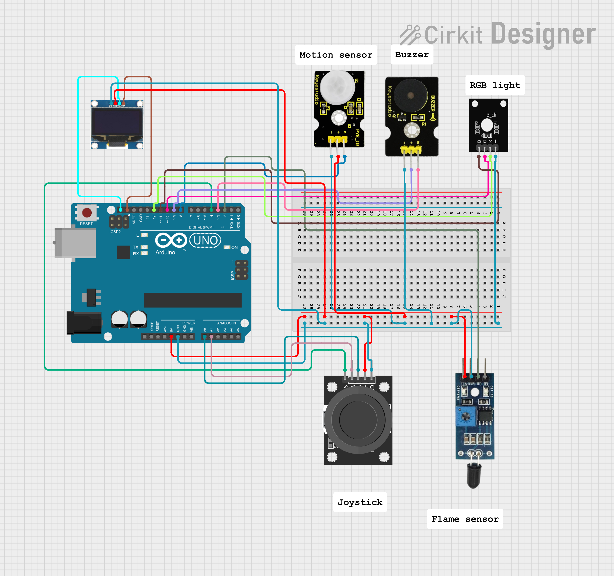
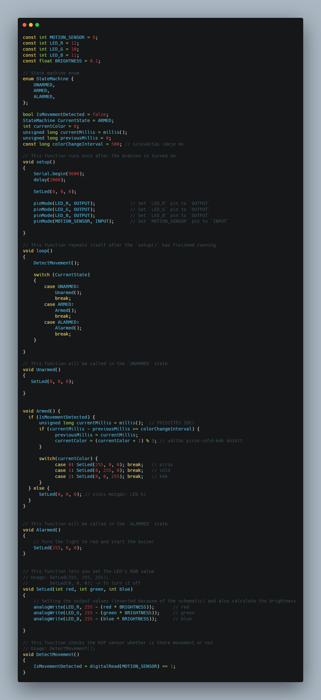
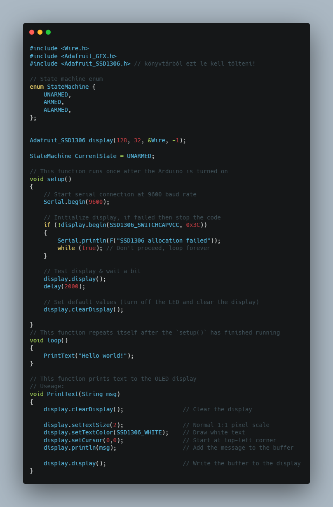

# 🏠 Okosotthon

**🎯Feladat:** Készíts egy biztonsági rendszert amely érzékeli a mozgást 🏃‍♂️, tüzet 🔥 és ajtónyitást 🚪, valamint vezérli a világítást 💡 és riasztást 🔊.

**🛠️ Fontos:** 📝 mindent a rajz alapján csináljatok, mert így biztosított a tökéletes működés. A progranban az elnevezések relatívak, nem muszáj azt használni. Ha mást használtok, akkor figyeljetek arra, hogy könnyen lehessen azonosítani az egyes vátozó neveket. 🔍

🤓 Aki foglalkozott már hasonlóval és szertne egy kicsit bonyolultabb feladaton gondolkodni annak van egy **exta feladat** a füzet végén. 📖💡

🔗 Minden feladatrész ugyanahoz a feladathoz tartozik. A feladatok között nem kell semmit átállítani, vagy megváltoztani. Ha egy feladatban egy elemet nem használsz és be van kötve attól nem lesz rossz, nem kell kivenni az alapból. 🔄✅

---
**Tartalomjegyzék:**
-   [Eszközök](#️-eszközök-amikre-szükséged-lesz)
-   [0. Feladat](#0-feladat)
-   [1. Feladat](#1-feladat)
-   [2. Feladat](#2-feladat) 
-   [3. Feladat](#3-feladat)
-   [4. Feladat](#4-feladat)
-   [Teljes rendszer](#a-teljes-rendszer-működtetése)
-   [Extra Feladat](#extra-feladat)

---

# 🛠️ Eszközök, amikre szükséged lesz:
- Arduino UNO 🖥️⚡
- PIR mozgásérzékelő 🏃‍♂️🔍
- Flame sensor 🔥🛑
- RGB LED 🌈💡
- Buzzer 🔊⚠️
- 0802 LCD kijelző 📟🖥️
- Joystick modul 🎮🔢
- Szervómotor 🔐🚪

---

# 0. Feladat:
⚙️ Kapcsolási rajz: (Először ez alapján csináljátok meg a kezdő állapotot.) 

---

# 1. Feladat:
🔔 Buzzer vezérlés Arduino-val 🎵
**🛠️ Feladatleírás:** Ebben a projektben egy buzzer (piezo hangszóró) vezérlését fogjuk megvalósítani. A cél, hogy a buzzer folyamatosan hangot adjon ki meghatározott időközönként.

**📋 A feladat lépései**
⚙️ Állítsd be a hardvert:
- Csatlakoztass egy piezo buzzert a D3-as digitális lábra.
- (Opcionális) Csatlakoztass egy LED-et a D9-es lábra, amely halványan világít a program elindulásakor.

🧠 Értsd meg a program működését:
- A setup() függvény inicializálja a buzzer lábat kimenetként és beállít egy alap fényszintet a LED-nek.
- A loop() függvény folyamatosan 100 Hz frekvenciájú hangot ad ki a buzzerre, fél másodperces szünetekkel.

🔄 Kód részletei:
- tone(BUZZER, 100); – 100 Hz-es hang indítása
- delay(500); – fél másodperc várakozás
- A IsBuzzerOn változó itt nem befolyásolja a működést, de később bővítéshez használható.

---

# 2. Feladat:
🔥 Tűzriasztó rendszer 🚨
**🛠️ Feladat:** Ebben a projektben egy egyszerű tűzjelző rendszert fogsz készíteni. A rendszer képes észlelni, ha tűz van a közelben (🔥), és riasztást ad ki egy piezo buzzer segítségével (🔔). A rendszer viselkedését egy állapotgép (State Machine) szabályozza.

**A program három állapotot kezel:**
- 🟡 UNARMED – A rendszer ki van kapcsolva, buzzer nem szól.
- 🟢 ARMED – A rendszer figyel, ha tüzet érzékel, riaszt.
- 🔴 ALARMED – Tűz észlelve, a buzzer szaggatott hangjelzést ad ki.

**⚙️ Főbb funkciók**
- DetectFlame() – Érzékeli, ha lángot észlel a szenzor.
- Armed() – Ha tüzet érzékel, állapotot vált ALARMED-re.
- Alarmed() – Buzzer ki-be kapcsol, riasztás mód.
- Unarmed() – Kikapcsolt állapot, buzzer némán.

🎯 Cél:🔧 Hozz létre egy megbízható tűzriasztó rendszert, amely:
- figyel a környezetre,
- felismeri a veszélyt,
- hangjelzéssel figyelmeztet.

---

# 3. Feladat:

---

# 4. Feladat:

---

# Teljes rendszer
**A teljes okosotthon vezérlése** 🏠

🎯 Feladat: 

🛠️ Rendszer elemei:
- Arduino UNO 🖥️⚡
- PIR mozgásérzékelő 🏃‍♂️🔍
- Flame sensor 🔥🛑
- RGB LED 🌈💡
- Buzzer 🔊⚠️
- 0802 LCD kijelző 📟🖥️
- Joystick modul ( jelszóbevitelhez ) 🎮🔢
- Szervómotor ( ajtózár vezérléséhez ) 🔐🚪

⚙️ Rendszer működés:
🟢 UNARMED (Hatástalanított)
- 🚪 Az ajtó kinyílik.
- 👀 Mozgás esetén a LED fehér színűre vált.
- 📟 A felhasználó joystick segítségével megadhatja a 4 karakteres jelszót (csak nagybetűk és számok).
- ✅ Ha helyes jelszót ad meg → rendszer ARMED állapotba vált.

🟡 ARMED (Élesített)
- 🚪 Az ajtó bezárul.
- 🔶 A LED narancssárgára vált.
- 🔐 Újra be lehet írni a jelszót a hatástalanításhoz.
- 🚨 Ha mozgást érzékel → rendszer ALARMED állapotba lép.

🔴 ALARMED (Riasztás)
- 🚪 Az ajtó zárva marad.
- 🔴 A LED piros színűre vált.
- 🔊 A buzzer sípol.
- 🔥 Ha lángot érzékel → azonnal ebbe az állapotba lép.
- 🔓 Helyes jelszó esetén visszavált UNARMED állapotba.

🎮 Joystick vezérlés
- 🔼 Fel: Jelenlegi karakter növelése
- 🔽 Le: Jelenlegi karakter csökkentése
- ◀️ Balra: Előző karakter pozíció
- ▶️ Jobbra: Következő karakter pozíció
- 🆗 Gomb nyomva: Jelszó megerősítése

📺 OLED kijelző
- Folyamatosan mutatja az aktuálisan beírt jelszót.
- Segítséget nyújt a karakterválasztáshoz.

### **🏆 Extra feladat:**  
**🛠️ Extra feladat:** Ha elkészült az alap projekt, és van kedved feltúrbózni, itt egy gondolkodós kihívás! 🤔

**Hibás jelszó számláló**
🔁 Vezess be egy számlálót, amely figyeli a hibás jelszópróbálkozásokat.
🔐 3 hibás próbálkozás után a rendszer 10 másodpercre zárolja a joystick bevitelét.

**Állapot kijelzése OLED-en**
📺 Jelenítsd meg az OLED kijelzőn mindig az aktuális rendszerállapotot:
„Status: UNARMED / ARMED / ALARMED”

**Jelszó karakter megvilágítás LED-del**
🔠 A kiválasztott karakter pozíciójától függően változtasd az RGB LED színét (pl. első karakternél kék, másodiknál zöld stb.)

✅ Sok sikert! 😊