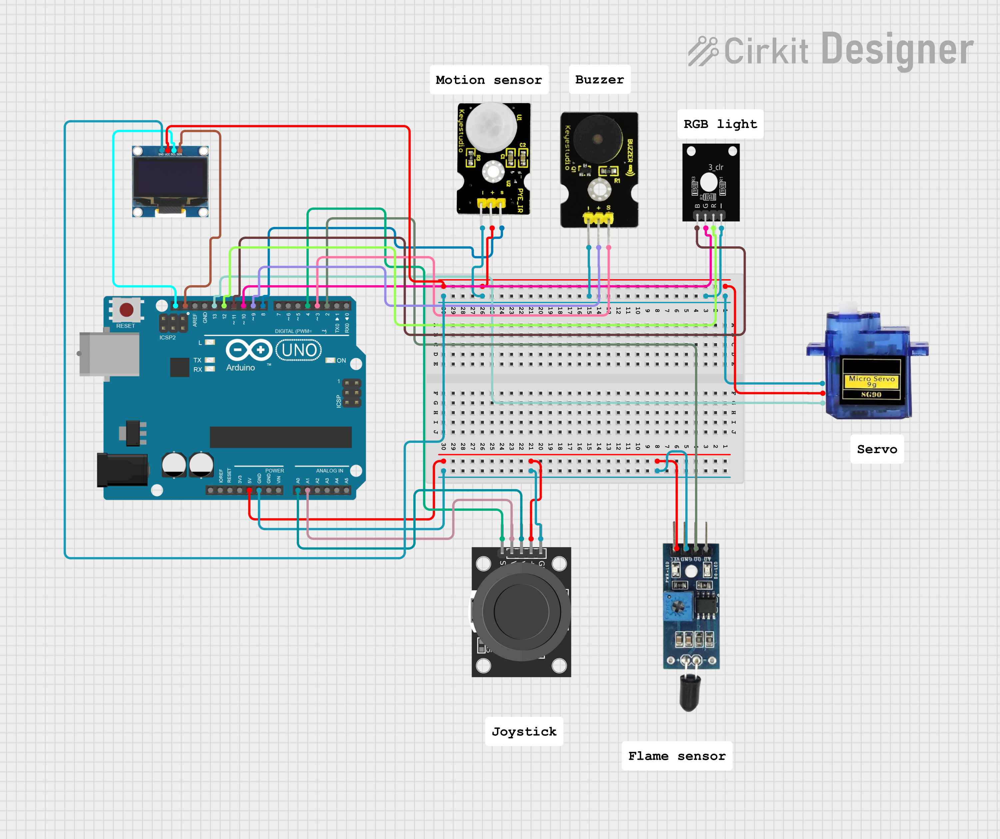
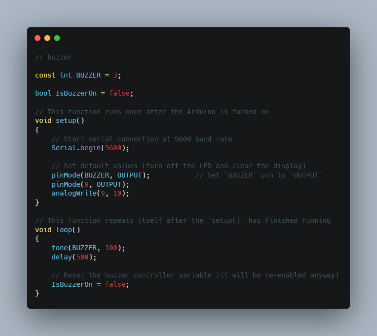
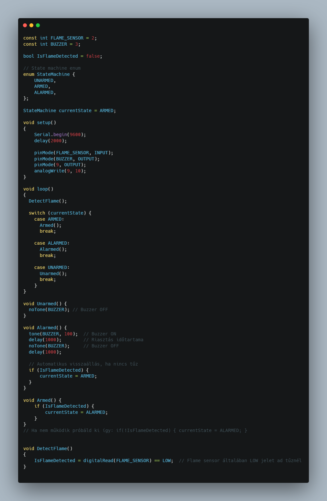
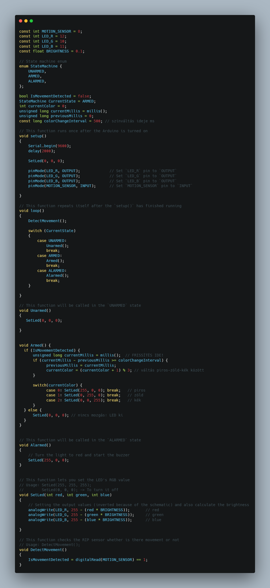
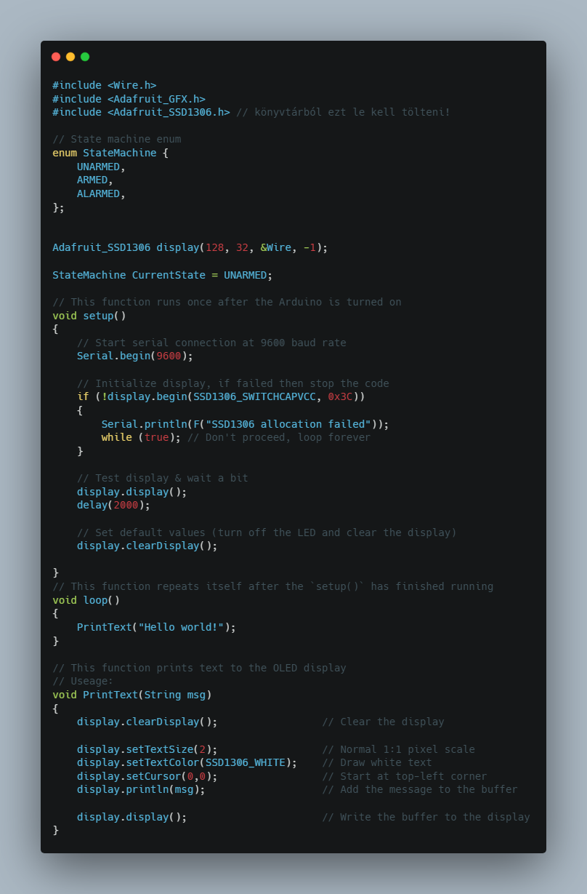
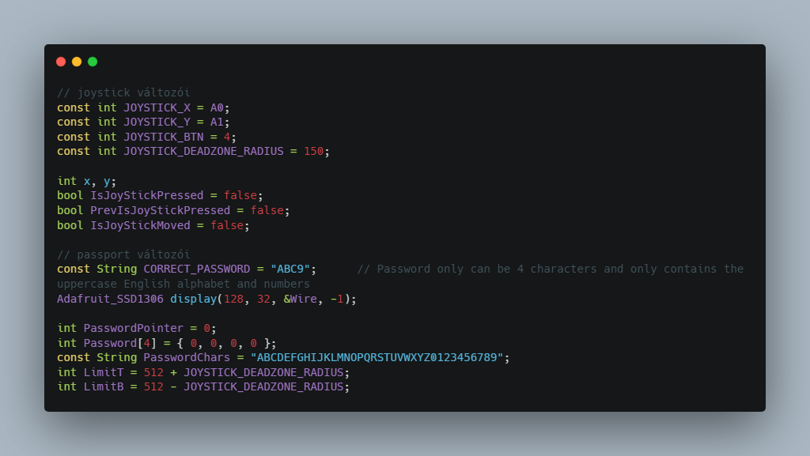

# 🏠 Okosotthon

**🎯Feladat:** Készíts egy biztonsági rendszert amely érzékeli a mozgást 🏃‍♂️, tüzet 🔥 és ajtónyitást 🚪, valamint vezérli a világítást 💡 és riasztást 🔊.

**🛠️ Fontos:** 📝 mindent a rajz alapján csináljatok, mert így biztosított a tökéletes működés. A progranban az elnevezések relatívak, nem muszáj azt használni. Ha mást használtok, akkor figyeljetek arra, hogy könnyen lehessen azonosítani az egyes vátozó neveket. 🔍

🤓 Aki foglalkozott már hasonlóval és szertne egy kicsit bonyolultabb feladaton gondolkodni annak van egy **exta feladat** a füzet végén. 📖💡

🔗 Minden feladatrész ugyanahoz a feladathoz tartozik. A feladatok között nem kell semmit átállítani, vagy megváltoztani. Ha egy feladatban egy elemet nem használsz és be van kötve attól nem lesz rossz, nem kell kivenni az alapból. 🔄✅

---
**Tartalomjegyzék:**
-   [Eszközök](#️-eszközök-amikre-szükséged-lesz)
-   [0. Feladat](#0-feladat)
-   [1. Feladat](#1-feladat)
-   [2. Feladat](#2-feladat) 
-   [3. Feladat](#3-feladat)
-   [4. Feladat](#4-feladat)
-   [Joystick használata](#joystick-os-jelszavas-zár-)
-   [Teljes rendszer](#teljes-rendszer)
-   [Extra Feladat](#-extra-feladat)

---

# 🛠️ Eszközök, amikre szükséged lesz:
- Arduino UNO 🖥️⚡
- PIR mozgásérzékelő 🏃‍♂️🔍
- Flame sensor 🔥🛑
- RGB LED 🌈💡
- Buzzer 🔊⚠️
- 0802 LCD kijelző 📟🖥️
- Joystick modul 🎮🔢
- Szervómotor 🔐🚪

---

# 0. Feladat:
⚙️ Kapcsolási rajz: (Először ez alapján csináljátok meg a kezdő állapotot.) 


---

# 1. Feladat:
🔔 Buzzer vezérlés Arduino-val 🎵
**🛠️ Feladatleírás:** Ebben a projektben egy buzzer (piezo hangszóró) vezérlését fogjuk megvalósítani. A cél, hogy a buzzer folyamatosan hangot adjon ki meghatározott időközönként.

**📋 A feladat lépései**
⚙️ Állítsd be a hardvert:
- Csatlakoztass egy piezo buzzert a D3-as digitális lábra.
- (Opcionális) Csatlakoztass egy LED-et a D9-es lábra, amely halványan világít a program elindulásakor.

🧠 Értsd meg a program működését:
- A setup() függvény inicializálja a buzzer lábat kimenetként és beállít egy alap fényszintet a LED-nek.
- A loop() függvény folyamatosan 100 Hz frekvenciájú hangot ad ki a buzzerre, fél másodperces szünetekkel.

🔄 Kód részletei:
- tone(BUZZER, 100); – 100 Hz-es hang indítása
- delay(500); – fél másodperc várakozás
- A IsBuzzerOn változó itt nem befolyásolja a működést, de később bővítéshez használható.



---

# 2. Feladat:
🔥 Tűzriasztó rendszer 🚨
**🛠️ Feladat:** Ebben a projektben egy egyszerű tűzjelző rendszert fogsz készíteni. A rendszer képes észlelni, ha tűz van a közelben (🔥), és riasztást ad ki egy piezo buzzer segítségével (🔔). A rendszer viselkedését egy állapotgép (State Machine) szabályozza.

**A program három állapotot kezel:**
- 🟡 UNARMED – A rendszer ki van kapcsolva, buzzer nem szól.
- 🟢 ARMED – A rendszer figyel, ha tüzet érzékel, riaszt.
- 🔴 ALARMED – Tűz észlelve, a buzzer szaggatott hangjelzést ad ki.

**⚙️ Főbb funkciók**
- DetectFlame() – Érzékeli, ha lángot észlel a szenzor.
- Armed() – Ha tüzet érzékel, állapotot vált ALARMED-re.
- Alarmed() – Buzzer ki-be kapcsol, riasztás mód.
- Unarmed() – Kikapcsolt állapot, buzzer némán.

🎯 Cél:🔧 Hozz létre egy megbízható tűzriasztó rendszert, amely:
- figyel a környezetre,
- felismeri a veszélyt,
- hangjelzéssel figyelmeztet.



---

# 3. Feladat:
🚨 Mozgásérzékelős LED-es biztonsági rendszer💡

**🛠️ Feladat leírása:** Készíts egy alap biztonsági rendszert, amely egy mozgásérzékelőt (PIR szenzort) és egy RGB LED-et használ az állapotok vizuális jelzésére. A rendszer három állapotot különböztet meg:
- 🟢 UNARMED – Nincs védelem, a LED világít, ha mozgást érzékel.
- 🟠 ARMED – A rendszer aktív, figyeli a mozgást.
- 🔴 ALARMED – Mozgás érzékelve, riasztás! A LED pirosra vált.

**📜 A program működése**
✅ setup(): 
- Inicializálja a lábakat és alapértékeket állít be.

🔁 loop():
- Folyamatosan olvassa a mozgásérzékelőt (DetectMovement()).
- A rendszer állapota alapján meghívja a megfelelő függvényt: Unarmed(), Armed(), Alarmed().

🧠 Állapotok:
**UNARMED**
- Ha mozgást érzékel ➡️ LED fehér (255, 255, 255)
- Ha nincs mozgás ➡️ LED kikapcsol

**ARMED**
- LED narancssárga (255, 255, 0)
- Ha mozgást érzékel ➡️ ALARMED állapotba vált

**ALARMED**
- LED pirosra vált (255, 0, 0)

**🎯 Cél**
Építs egy rendszert, ami:
- 👁️‍🗨️ képes mozgást érzékelni,
- 🚦 vizuálisan jelzi az állapotát,
- 🔁 logikusan vált a három állapot között.



---

# 4. Feladat:
🖥️ OLED kijelző szövegmegjelenítő Arduino-val 📟
**🛠️ Feladat leírása:** Készíts egy egyszerű programot, amely képes szöveget megjeleníteni egy OLED kijelzőn! A kijelző I²C kommunikációval csatlakozik az Arduino-hoz, és az Adafruit könyvtárak segítségével vezérelhető.

**💾 Kód működése**
A program:
- Inicializálja a kijelzőt a setup() függvényben.
- Ellenőrzi, hogy sikeres volt-e a kijelző beállítása.
- A loop() függvényben folyamatosan kiírja: "Hello world!"

**🧠 Főbb funkciók**
- display.begin(...) ➡️ kijelző inicializálása
- display.clearDisplay() ➡️ képernyő törlése
- display.setTextSize(...) ➡️ betűméret beállítása
- display.setCursor(...) ➡️ szöveg pozíciója
- display.println(...) ➡️ szöveg kiírása
- display.display() ➡️ megjelenítés frissítése



---

# Joystick-os jelszavas zár 🎮🔐

Ez a program egy jelszóval védett rendszer, amit egy joystick és egy OLED kijelző segítségével lehet vezérelni.

**🕹️ Joystick működése**
- ⬆️ Fel / ⬇️ Le → Az aktuális karakter váltása (pl. A → B vagy vissza).
- ⬅️ Bal / ➡️ Jobb → Karakter pozíció váltása (pl. 1. betű → 2. betű).
- 🔘 Gombnyomás → Beadja a jelszót és ellenőrzi.

**🔧 Változók deklarásása:** Eddigiekhez hasonlóan most is ezzel kezdük a program felépítését.



📌 Fontos: A teljes kódot másold be az Arduino IDE-be, töltsd fel a mikrokontrollerre, és nézd meg, hogyan reagál a joystick mozgásaira. Az alábbiakban a program működésének logikáját bontjuk lépésekre.

#### 1️⃣ Inicializálás és kijelző beállítása
A setup() függvény felelős az eszközök induláskori inicializálásáért:

- Soros kapcsolat elindítása a hibakereséshez (Serial.begin)
- OLED kijelző inicializálása (display.begin)
- A kijelző törlése, majd egy üzenet megjelenítése
- A joystick gomb bemenetként való beállítása

> 👉 Célja: felkészíteni a mikrokontrollert és a kijelzőt a működésre.

##### 2️⃣ Folyamatos működés: loop()
Ez a fő ciklus, ahol minden másodpercben frissül a rendszer:
- Beolvassa a joystick aktuális állapotát (UpdateJoystick())
- Ellenőrzi, hogy mozdítottuk-e a joystickot → módosítja a jelszót (ReadPass())
- Kirajzolja az aktuálisan összeállított jelszót (PrintPass())

📌 Jelszóellenőrzés: ha a joystick gombját lenyomták, akkor:
- összeállítja a beírt jelszót (4 karakter)
- összehasonlítja az előre megadott jelszóval
- kiírja a „Correct” vagy „Wrong” szót a kijelzőre
- vár 2 másodpercet, majd törli a jelszót

##### 3️⃣ A joystick kezelése: UpdateJoystick()
Ez a függvény beolvassa a joystick X és Y tengelyének analóg értékeit és a gomb állapotát:

```cpp
x = analogRead(JOYSTICK_X);
y = analogRead(JOYSTICK_Y);
IsJoyStickPressed = digitalRead(JOYSTICK_BTN) == HIGH;
```

🕹️ Gombnyomás figyelése: A rendszer csak akkor reagáljon, ha a joystick gombot frissen nyomták le (ne ismétlődően). Ehhez figyeld a korábbi állapotot: PrevIsJoyStickPressed.

🔡 Jelszó összeállítása és ellenőrzése:
- Az aktuálisan beállított karaktereket (Password tömb) alakítsd át egy szöveggé (enteredPassword) a PasswordChars alapján.
- Hasonlítsd össze az előre beállított jelszóval: CORRECT_PASSWORD.

🖥️ OLED kijelző visszajelzés:
- ✅ Helyes jelszó esetén: jelenjen meg a „Correct” szöveg.
- ❌ Hibás jelszó esetén: jelenjen meg a „Wrong” szöveg.
- ⏳ 2 másodpercig tartsd meg az üzenetet, majd nullázd a jelszót.

``` cpp
// Ha megnyomták a joystick gombját, és előzőleg nem volt lenyomva
    if (IsJoyStickPressed && !PrevIsJoyStickPressed)
    {
        PrevIsJoyStickPressed = true;

        // Összerakjuk a beállított jelszót stringként
        String enteredPassword = "";
        for (int i = 0; i < 4; i++)
        {
            enteredPassword += PasswordChars[Password[i]];
        }

        // Ellenőrizzük a jelszót
        if (enteredPassword == CORRECT_PASSWORD)
        {
            PrintText("Correct");
        }
        else
        {
            PrintText("Wrong");
        }

        delay(2000); // Rövid szünet a visszajelzéshez
        for (int i = 0; i < 4; i++) Password[i] = 0; // Jelszó nullázása
    }
```


---

# Teljes rendszer
**A teljes okosotthon vezérlése** 🏠

🎯 Feladat: 

🛠️ Rendszer elemei:
- Arduino UNO 🖥️⚡
- PIR mozgásérzékelő 🏃‍♂️🔍
- Flame sensor 🔥🛑
- RGB LED 🌈💡
- Buzzer 🔊⚠️
- 0802 LCD kijelző 📟🖥️
- Joystick modul ( jelszóbevitelhez ) 🎮🔢
- Szervómotor ( ajtózár vezérléséhez ) 🔐🚪

⚙️ Rendszer működés:
🟢 UNARMED (Hatástalanított)
- 🚪 Az ajtó kinyílik.
- 👀 Mozgás esetén a LED fehér színűre vált.
- 📟 A felhasználó joystick segítségével megadhatja a 4 karakteres jelszót (csak nagybetűk és számok).
- ✅ Ha helyes jelszót ad meg → rendszer ARMED állapotba vált.

🟡 ARMED (Élesített)
- 🚪 Az ajtó bezárul.
- 🔶 A LED narancssárgára vált.
- 🔐 Újra be lehet írni a jelszót a hatástalanításhoz.
- 🚨 Ha mozgást érzékel → rendszer ALARMED állapotba lép.

🔴 ALARMED (Riasztás)
- 🚪 Az ajtó zárva marad.
- 🔴 A LED piros színűre vált.
- 🔊 A buzzer sípol.
- 🔥 Ha lángot érzékel → azonnal ebbe az állapotba lép.
- 🔓 Helyes jelszó esetén visszavált UNARMED állapotba.

🎮 Joystick vezérlés
- 🔼 Fel: Jelenlegi karakter növelése
- 🔽 Le: Jelenlegi karakter csökkentése
- ◀️ Balra: Előző karakter pozíció
- ▶️ Jobbra: Következő karakter pozíció
- 🆗 Gomb nyomva: Jelszó megerősítése

📺 OLED kijelző
- Folyamatosan mutatja az aktuálisan beírt jelszót.
- Segítséget nyújt a karakterválasztáshoz.

---

# **🏆 Extra feladat:**  
**🛠️ Extra feladat:** Ha elkészült az alap projekt, és van kedved feltúrbózni, itt egy gondolkodós kihívás! 🤔

**Hibás jelszó számláló**
🔁 Vezess be egy számlálót, amely figyeli a hibás jelszópróbálkozásokat.
🔐 3 hibás próbálkozás után a rendszer 10 másodpercre zárolja a joystick bevitelét.

**Állapot kijelzése OLED-en**
📺 Jelenítsd meg az OLED kijelzőn mindig az aktuális rendszerállapotot:
„Status: UNARMED / ARMED / ALARMED”

**Jelszó karakter megvilágítás LED-del**
🔠 A kiválasztott karakter pozíciójától függően változtasd az RGB LED színét (pl. első karakternél kék, másodiknál zöld stb.)

✅ Sok sikert! 😊
