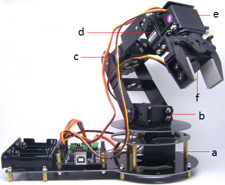

# Robotkar 🤖💪

**🔧 Projektleírás:** 
Ebben a projektben egy több szervómotorral vezérelt, asztali méretű robotkart építünk meg Arduino segítségével. A cél, hogy a diákok játékosan, mégis mélyrehatóan ismerkedjenek meg az aktuátorvezérlés, a mozgásprogramozás, valamint az ismételhető műveletsorok megvalósításával.

**🕹️ Egyéni vezérlés potméterekkel:**
Először a robotkar minden egyes tengelyét külön vezérelheted potméterek segítségével. Ez lehetővé teszi, hogy megtanuld, hogyan mozog egy szervó, és hogyan kapcsolódnak egymáshoz a kar részei.

**🤲 Szinkronizált mozgás – több szervó egy időben:**
Miután az alapmozgások mennek, egyszerre fogod vezérelni az összes szervót. Ezáltal képes leszel komplex, természetes mozgásokat létrehozni (pl. „fogd meg – emeld fel – tedd le”).

**💾 Pozíciók mentése és visszajátszása:**
A program lehetőséget biztosít arra, hogy kulcspozíciókat elments, majd ezeket sorrendben visszajátszd. Így a robotkar képes lesz egy adott feladatot automatikusan elvégezni, például egy tárgy áthelyezését egyik helyről a másikra.

**🔁 Feladat automatizálása:**
A robotkarod már nem csak egy eszköz, hanem egy programozható gép, amely képes újra és újra elvégezni ugyanazt a feladatot – emberi beavatkozás nélkül!


**🛠️ Fontos:** 📝 mindent a rajz alapján csináljatok, mert így biztosított a tökéletes működés. A progranban az elnevezések relatívak, nem muszáj azt használni. Ha mást használtok, akkor figyeljetek arra, hogy könnyen lehessen azonosítani az egyes vátozó neveket. 🔍

🤓 Aki foglalkozott már hasonlóval és szertne egy kicsit bonyolultabb feladaton gondolkodni annak van egy **exta feladat** a füzet végén. 📖💡

🔗 Minden feladatrész ugyanahoz a feladathoz tartozik. A feladatok között nem kell semmit átállítani, vagy megváltoztani. Ha egy feladatban egy elemet nem használsz és be van kötve attól nem lesz rossz, nem kell kivenni az alapból. 🔄✅

---
**Tartalomjegyzék:**
-   [Eszközök](#️-eszközök-amikre-szükséged-lesz)
-   [0. Feladat](#0-feladat)
-   [1. Feladat](#1-feladat)
-   [2. Feladat](#2-feladat) 
-   [3. Feladat](#3-feladat)
-   [4. Feladat](#4-feladat)
-   [Extra Feladat](#extra-ötlet)

---

# 🛠️ Eszközök, amikre szükséged lesz:
- 🧠 Arduino Mega
- ⚙️ 6 db szervómotor
- 🧩 Servo Shield 
- 🎛️ 4 db potméter
- 🔋 5V/6V tápegység a szervómotorok tápellátásához

---

# 0. Feladat:
⚙️ Kapcsolási rajz: (Először ez alapján csináljátok meg a kezdő állapotot.) 


### Az alábbi rajzon látható a robotkar és tengelyei. 

> important
> vigyázzatok!



---

# 1. Feladat:

## Szervómotorok vezérlése potméterrel – Lépésről lépésre

Ebben a feladatban megtanulod, hogyan lehet egy szervómotort (vagy többet) vezérelni egy potméter segítségével. Ez a robotkar alapja, hiszen minden ízületet (tengelyt) egy szervómotor mozgat, a potméter pedig olyan, mint egy "kézi vezérlő".

### 1. Mi az a szervómotor?
A szervómotor egy olyan motor, amelyet pontosan be tudsz állítani egy adott szögbe. Ezért tökéletes robotkarokhoz, ahol minden tengelynek pontosan kell mozognia.

### 2. Mi az a potméter?
A potméter egy tekerhető ellenállás, amivel egy analóg jelet (0-1023) tudsz beállítani. Olyan, mint egy hangerőszabályzó, csak itt a szervó szögét állítod vele.

### 3. Hogyan működik együtt?
- A potmétert az Arduino analóg bemenetére kötöd (pl. A0).
- A szervót egy PWM (pl. D9) kimenetre kötöd.
- Az Arduino beolvassa a potméter értékét, és átszámolja egy szögre (pl. 70-140 fok).
- A szervó ezt a szöget beállítja.

### 4. Lépésről lépésre példa

**Bekötés:**
- Potméter középső lába: A0
- Potméter két szélső lába: 5V és GND
- Szervó narancs: D9, piros: 5V, barna: GND

**Kód részlet:**
```cpp
#include <Servo.h>
Servo szervo1;
void setup() {
  szervo1.attach(9); // Szervó a D9-re
}
void loop() {
  int pot = analogRead(A0); // Potméter olvasása
  int szog = map(pot, 0, 1023, 70, 140); // Átszámolás szögre
  szervo1.write(szog); // Szervó beállítása
  delay(15); // Stabil működés
}
```

### 5. Miért fontos ez?
A robotkar minden ízületét így tudod kézzel mozgatni, "tanítani". Ha ezt érted, már tudsz egy teljes kart is vezérelni több potméterrel és szervóval.

### 6. Extra ötletek, magyarázatok
- Próbáld ki, hogy több szervót és potmétert kötsz be! (pl. szervo2.attach(10), pot2 = analogRead(A1), stb.)
- Írd ki a soros monitorra a potméter és szervó értékeket, hogy lásd, mi történik!
- Gondold végig: ha minden szervó egy-egy ízület, hány szabadságfoka van a robotkarnak?

---

# 2. Feladat:

## Szervómotorok pontosabb vezérlése – PWM és finomhangolás

Most tovább lépünk: nem csak szöget állítunk, hanem közvetlenül a szervó vezérlőjelét (PWM – impulzusszélesség) szabályozzuk. Ez még pontosabb mozgást tesz lehetővé, és közelebb visz a profi robotikához!

### 1. Mi az a PWM?
A PWM (Pulse Width Modulation) egy olyan jel, amivel a szervó "megmondja", milyen szögbe álljon. A jel hossza (pl. 500-2500 mikrosec) határozza meg a szöget.

### 2. Miért jó közvetlenül PWM-et vezérelni?
- Finomabb, pontosabb mozgás
- Egyes szervók csak bizonyos PWM tartományban működnek jól
- Profi robotikában gyakran közvetlenül PWM-mel dolgozunk

### 3. Lépésről lépésre példa

**Bekötés:**
- Ugyanaz, mint az előző feladatban

**Kód részlet:**
```cpp
#include <Servo.h>
Servo szervo1;
const int MIN_PWM = 500;   // Minimum impulzus (0 fok)
const int MAX_PWM = 2500;  // Maximum impulzus (180 fok)
void setup() {
  szervo1.attach(9);
}
void loop() {
  int pot = analogRead(A0);
  int pwm = map(pot, 0, 1023, MIN_PWM, MAX_PWM);
  szervo1.writeMicroseconds(pwm); // Közvetlen PWM vezérlés
  delay(15);
}
```

### 4. Fokozatos mozgatás – miért jó?
Ha a szervót nem "ugrasztod" azonnal a célpozícióba, hanem kis lépésekben mozgatod, a mozgás simább, a robotkar nem rángatózik.

**Példa:**
```cpp
for (int szog = 70; szog <= 140; szog++) {
  szervo1.write(szog);
  delay(10);
}
```

### 5. Miért fontos ez?
A robotkar precíz, ismételhető mozgásához elengedhetetlen a pontos vezérlés. Ha később programból szeretnél mozdulatsorokat tanítani, a PWM-es vezérlés lesz az alap.

### 6. Extra ötletek, magyarázatok
- Próbáld ki, hogy a szervót lassan mozgatod egyik pozícióból a másikba!
- Mérd meg, hogy a különböző szervók milyen PWM tartományban működnek jól!
- Gondold végig: hogyan lehetne több szervót egyszerre, szinkronban mozgatni?

---

# 3. Feladat:

## Kiterjesztett Példasorozat: Összehangolt Szervomotor Mozgatás

Ebben a részben egy átfogó, lépésenkénti útmutatót adunk arról, hogyan valósul meg az összehangolt szervomotor mozgatás a robotkarban. Gondolj erre, mint egy tananyagra, ami segít megérteni a technológiát kezdőktől haladókig. Használjuk a coordinatedMove függvény logikáját, hogy mutassuk be, hogyan kerül sor kontrollált, szinkronizált mozgásra több szervónál egyszerre.

### 1. Bevezetés az Összehangolt Mozgatásba
A összehangolt szervomotor mozgatás azt jelenti, hogy több motort egyszerre irányítunk, úgy hogy mindegyik simán és egyidejűleg érje el a célját. Ez fontos a robotkarban, mert ha a motorok nem mozognak együtt, a kar instabil lehet, például egy tárgy felemelésekor. Egyszerűen fogalmazva: képzeld el, hogy egy táncos csapatot vezetsz – mindenki ugyanabban a ritmusban mozog, hogy a műsor tökéletes legyen.

Példa: Ha a robotkar egy poharat emel fel, az összes szervó (pl. a kar könyöke, válla és csuklója) együtt kell mozogjon, különben a pohár eldőlhet.

### 2. Alapfogalmak, Amiket Ismernünk Kell
Mielőtt belemerülünk a részletekbe, nézzük meg az alapvető fogalmakat egyszerűen:
- **Szervó**: Egy motor, ami pontos szögbe állítható (pl. 0-180 fok). A mi kódban minden szervónak van egy aktuális szöge (deg) és egy cél szöge (new_deg).
- **Szinkronizálás**: Az, hogy a motorok együtt mozognak. A rendszer kiszámolja, mennyi időre van szükség a leghosszabb mozgáshoz, és ehhez igazítja a többit.
- **Apró Lépések**: Helyett hogy egy motor hirtelen ugrana a célba, kis lépésekben halad, pl. 1 fokonként, hogy sima legyen a mozgás.
- **Időzítés**: Rövid szünetek (delay) között, hogy a mozgás ne legyen túl gyors.

Példa: Képzeld, hogy autót vezetsz egy emelkedőn – nem lépsz rá hirtelen a gázra, hanem fokozatosan gyorsítasz, hogy kontroll alatt tudd.

### 3. Lépésenkénti Elmagyarázás a Mozgatás Logikájának
Most bontsuk le a coordinatedMove függvényt lépésről lépésre. Ez a funkció a robotkar kulcsa az összehangolt mozgáshoz. Minden lépést egyszerűen ismertetek, de nem hagyok ki semmit.

1. **Szögkülönbség Kiszámítása**: Először megvizsgáljuk, mennyit kell mozognia minden szervónak. A kódban ez történik: `int diff = static_cast<int>(ceil(abs(new_deg[i] - servos[i].get_deg())));`. Ez kiszámolja a különbséget a jelenlegi és a cél szög között, és kerekíti felfelé, hogy biztosan elég lépés legyen.
   - Miért fontos? Ha az egyik szervónak 50 fokot kell mozognia, a másiknak csak 10-et, akkor a rendszer a legnagyobb különbséget veszi alapul, hogy senki se érjen be túl korán.
   - Példa: Tegyük fel, hogy 3 szervónk van: A: 10 fok különbség, B: 20 fok, C: 30 fok. A maximum 30 fok, szóval a teljes mozgás ehhez igazodik.

2. **Lépések Számának Meghatározása**: A kód megszorozza a legnagyobb különbséget 5-tel (`maxDiff *= 5;`), hogy több, finomabb lépést kapjunk. Ez lassabb, de simább mozgást eredményez.
   - Miért? Ha túl gyorsan mozgunk, a szervók rángathatnak. Ez a szorzás extra óvatosságot ad.
   - Példa: Ha a maxDiff 30, akkor 150 lépés lesz, ami azt jelenti, hogy a mozgás nagyon apró, 0.2 fokos lépésekben történik.

3. **Apró Lépések Végrehajtása**: A kód egy ciklusban (`for (int step = maxDiff; step > 0; --step)`) hozzáad egy kis részt a jelenlegi szöghez minden szervónál: `servos[j].add_deg((new_deg[j] - servos[j].get_deg()) / step);`.
   - Miért működik? Minden lépésben csak egy töredékét adjuk a teljes különbségnek, így a szervók fokozatosan közelednek a célhoz, és mindig együtt haladnak.
   - Példa: Ha egy szervónak 30 fokot kell mozognia 150 lépésben, akkor az első lépésben hozzáad kb. 0.2 fokot, a következőben megint 0.2-t, és így tovább.

4. **Időzítés és Várakozás**: Minden lépés után van egy delay: `delay(del);`, ami tipikusan 10 ms.
   - Miért? Ez ad időt a szervóknak, hogy fizikailag kövessék a parancsot, így a mozgás nem lesz idegesítően gyors.
   - Példa: Képzeld, hogy egy zeneszámot játszol le – a delay mint a ritmus, ami biztosítja, hogy a lépések összehangoltak legyenek.

### 4. Példák a Gyakorlatban
Itt jönnek a konkrét példák, hogy lásd, hogyan működik ez valós helyzetekben. Ezeket a coordinatedMove logikára alapozva építettem fel.

1. **Egyszerű Példa: Egyetlen Mozgás Sorozata**
   Tegyük fel, hogy a robotkar egy tárgyat emel fel. A cél szögök: Szervó 1: 45 fok, Szervó 2: 90 fok, Szervó 3: 0 fok.
   - Lépések: A kód kiszámolja a különbségeket (pl. Szervó 1: 20 fok jelenleg, szóval diff=25). Majd 125 lépésben (ha maxDiff=25*5) apró lépésekkel mozog mindenki együtt.
   - Eredmény: A kar simán felemeli a tárgyat, anélkül, hogy billegne.

2. **Komplex Példa: Tárgy Áthelyezése**
   Képzeld, hogy a robotkart utasítjuk, hogy egy poharat vigyen A pontból B-be. Parancsok: Először állítsd be az új cél szögöket, majd hívd a coordinatedMove-t.
   - Részletek: Ha Szervó 1-nek 10 fokot, Szervó 2-nek 50 fokot kell mozognia, a kód biztosítja, hogy 250 lépésben (maxDiff=50*5) haladjanak együtt.
   - Probléma és Megoldás: Ha az egyik szervó lassabb, a delay-ek gondoskodnak róla, hogy ne hagyja le a másikat. Példa kimenet: A kar először felemeli a poharat, majd oldalra mozdítja, anélkül, hogy leejtené.

3. **Hibakezeléses Példa: Mit Teszünk, Ha Valami Rossz**
   Ha egy szervó határait túllépi (pl. megpróbál 180 foknál többet mozogni), a kód figyelmen kívül hagyja (lásd: `if (v < d_min || v > d_max)` a MyServo-ban). Példa: Ha egy szervó csak 0-90 fokig mehet, de cél 100 fok, akkor ott megáll, és a többi szervó folytatja szinkronban.
   - Tanulság: Mindig ellenőrizzük a határokat a valós tesztek során!

### Egy Megvalósítható Példakód 3 Szervóval
Itt egy egyszerűsített kódrészlet, ami csak 3 szervót használ, de ugyanazt az összehangolt mozgást valósítja meg, mint a teljes rendszer. Ez segít gyakorlati példaként megérteni a logikát.

```cpp
#include <Arduino.h>
#include <Servo.h>
#include <cmath>  // For ceil and abs

class MyServo {
public:
    float deg;  // Aktuális szög
    MyServo() { deg = 0; }  // Alapértelmezett konstruktor
    float get_deg() { return deg; }  // Szög lekérdezése
    void add_deg(float v) { deg += v; }  // Szög hozzáadása
};

const int servo_count = 3;  // Csak 3 szervó
float new_deg[servo_count] = {45.0, 90.0, 0.0};  // Cél szögök példaként
MyServo servos[servo_count];  // Szervók tömbje

void coordinatedMove(int del = 10) {
    int maxDiff = 0;
    for (int i = 0; i < servo_count; ++i) {
        int diff = static_cast<int>(ceil(abs(new_deg[i] - servos[i].get_deg())));
        if (diff > maxDiff) maxDiff = diff;
    }
    maxDiff *= 5;  // Több lépésért
    for (int step = maxDiff; step > 0; --step) {
        for (int j = 0; j < servo_count; ++j) {
            servos[j].add_deg((new_deg[j] - servos[j].get_deg()) / step);
        }
        delay(del);  // Rövid szünet
    }
}

void setup() {
    // Inicializálás: Például csatlakoztasd a szervókat
    // servos[0].attach(9); stb. – ezt manuálisan tedd hozzá a tesztekhez
    Serial.begin(9600);
}

void loop() {
    coordinatedMove();  // Hívd meg a mozgatást
    delay(2000);  // Várj 2 másodpercet a következő futtatásig
}
```

Ez a kód futtatható az Arduino-ban, és mutatja, hogyan mozognak a 3 szervó összehangoltan a megadott cél szögök felé. Teszteléskor állítsd be a tényleges pin-eket!

---

# 4. Feladat:

## Saját mozdulatsor programozása és visszajátszása

A robotkar képes több pozíciót is elmenteni, majd ezeket egymás után végrehajtani. Így például megtaníthatod a kart, hogy felemeljen egy tárgyat, áthelyezze, majd visszatérjen a kiinduló helyzetbe.

### Lépések:

1. **Állítsd be a kart a kívánt pozícióba** (pl. potméterekkel vagy soros parancsokkal: `mov 0 0`, `mov 1 45`, stb.)
2. **Mentsd el a pozíciót:**
   ```
   save_cur 0
   ```
3. **Állítsd be a következő pozíciót** (pl. másik tárgy fölé, más szögekkel), majd mentsd el:
   ```
   save_cur 1
   ```
4. **Tetszőleges számú pozíciót elmenthetsz (pl. 0-9-ig).**
5. **A mozdulatsor visszajátszása:**
   ```
   load 0
   go
   load 1
   go
   load 0
   go
   ```
   Ezzel a kar végrehajtja a tanított mozdulatsort.

### Automatizált visszajátszás (bővítés):

Írhatsz egy egyszerű ciklust a soros monitoron keresztül, vagy akár a kódot is bővítheted, hogy egy gombnyomásra végigmenjen az összes elmentett pozíción:

```cpp
for (int i = 0; i < 3; ++i) {
    servos.load(i);
    servos.move();
}
```

### Tippek, magyarázatok:
- **A mozgás mindig szinkronizált, minden szervó egyszerre mozog.**
- **A LED szalag pirosan világít mozgás közben, sárgán, ha végzett.**
- **A pozíciók elmentése után a robotkar képes ismételni a tanult mozdulatsort, akárhányszor.**
- **A parancsokat a soros monitoron keresztül adhatod ki, így könnyen kísérletezhetsz.**

### Extra ötlet:
- **Írj egy "macro" parancsot, ami egy előre elmentett mozdulatsort automatikusan végigjátszik!**
- **Próbáld ki, hogy a robotkar egy tárgyat felemel, áthelyez, majd visszatesz!**

---

# Összefoglalás

A valós robotkar.cpp kód sokkal többet tud, mint az alap potméteres vezérlés:
- 6 szervó, szinkronizált mozgás, pozíciók mentése, visszajátszása, LED visszajelzés, soros parancsvezérlés.
A 3. és 4. feladatban a diákok megtanulják a robotkar programozott vezérlését, a mozdulatsorok tanítását és visszajátszását, így valóban kipróbálhatják a robotot, és kreatívan használhatják a rendszert.

Ha elakadsz, nézd át ezt a leírást, vagy kérdezz bátran! Jó kísérletezést és jó tanulást! :)

